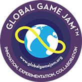

## The concept

Imagine you can only see the world through echolocation? Try to reach the border of the pond avoiding the many obstacles. Every obstacles won't respond the same way depending on the frequency you use, cycle through five differents one to map the pond.

## The context

This game was made in 48h during the Global Game Jam 2014 in Paris.

## The team

* Thomas Poulet *"Lord Nazdar"* : Game Design - Graphic Design - Development
* Sébastien Morinière *"Rodyll"* : Game Design - Development
* Victor Haffreingue *"Padawan"* : Sound Design - Development
* David Auriac *"Dalzark"* : Game Design - Development

## The controls

Player 1: Left-click & drag to move, right click to change frequency
Player 2: Keyboard arrow keys to move, space to change frequency

## Github

Check the project on Github. The project is released under the MIT License.

## The Music

Listen to the cool music composed by *Padawn*, don't forget to check his awesome channel too!
<iframe width="100%" height="450" scrolling="no" frameborder="no" src="https://w.soundcloud.com/player/?url=https%3A//api.soundcloud.com/playlists/58751061&color=ff5500&auto_play=false&hide_related=false&show_comments=true&show_user=true&show_reposts=false"></iframe>

## [Sound of the pond](http://lord-nazdar.github.io/Global-Game-Jam/)
