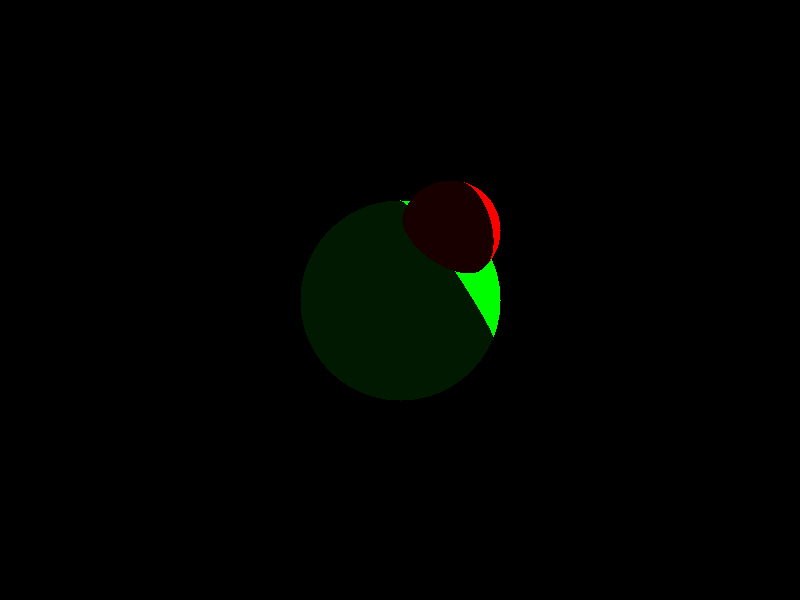

## Introduction

After few weeks messing around on this project, I eventually convinced myself that writing a devblog is the best way for me to stay committed. I will try during the process to explain my technological choices as well as giving some theoretical clues. Please keep in mind that I’m not an expert in computer graphics, thus my choices might be confuse or incomplete. Feel free to send me any advises, I’m here to learn!

### Path tracer vs Rasterizer

Before diving into the main subject, we should have a look at the two major paradigms in computer graphics: Rasterization and Path Tracing. While the two are designed to produce images from 3D scene, they are fundamentally different, and are more or less the exact opposite of each other.

#### Rasterization

During the rasterization process, the algorithm tries to look which pixels on the image is covering a particular shape. The method is efficient for rendering scenes at very high speed, this is why it’s used in computer games where you only have 0.016 second to render a frame.
The rendering time is highly dependent on the number of considered shapes, as you can see on the example below.

```cpp
foreach object{
    Get corresponding pixel on the image and apply object color
}
```

This process can be optimized by using different culling algorithms to reduce the number of objects to evaluate.

#### Path Tracer

On the other hand, path tracer tries to evaluate for each pixels of the image the amount of light received. Because ray tracers are simulating the real path of light, they tend to produce higher fidelity images. However, where Rasterizer are almost only dependent on the number of shapes, path tracers are dependent on the image size, and the light algorithm used. Let’s have a look at the example below:

```cpp
foreach pixel{
    Get Object Material Value by firing a ray at it
    Fire recursive rays to refine initial value
   Apply final color value to pixel
}
```

As you can see, the bigger the image, the longer it takes. This is why this method is mainly used in film and animation industry, where the images can be rendered before display.

## Renderer

### Casting Rays

As we saw during the introduction, ray tracer is all about casting rays to objects and getting their position back. As we will see later on in the series, there is multiple ways to represent surfaces (triangles, quads, primitive geometries …), however for this first few weeks I chose to limit myself to sphere primitives.
Let’s have a look at the theory behind ray – sphere intersection computation.
We have our sphere parametric equation:

$$x^2+y^2+z^2=r^2$$

$$\parallel p - p_{c} \parallel ^2 = r^2$$

With \\(p\\) a point on the sphere and \\(p_{c}\\) the sphere center point.
We also have the ray equation: 

$$x=td+p_{o}$$

With \\(t\\) the distance along the line of the point from the origin, \\(d\\) the direction of the ray, and \\(p_{o}\\) the origin point of the ray.  
We can combine the two equations to get the intersection point:

$$\parallel (td+p_{o})-p_{c} \parallel^2 = r^2$$

And by simplifying this equation we get a simple quadratic form:

$$d.dt^2+2d.(p_{o}-p_{c})t+(p_{o}-p_{c}).(p_{o}-p_{c})-r^2=0$$

### Light

As soon as we are able to detect collision between our objects and our rays, we can start computing light. Let’s have a look at the diagram below.


As we can see, in this first version we have ray leaving the camera, as soon as it encounter an object we get the normal to the surface to know if the point is illuminated.

$$ intersection = rayOrigin + (rayDirection * distanceToIntersection)$$ 

$$ \left\lbrace\begin{array}{l}
x = \frac{intersectionX}{radius}\\\\
y = \frac{intersectionY}{radius}\\\\
z = \frac{intersectionZ}{radius}
\end{array}\right.$$ 

The first picture is the non-shaded version, the visible faces to the light are bright and the other aren’t. Tzhe second one is a shaded version including the shading factor based on the dot product of the vector to the light. The scene is also illuminated by an atmospheric light, for debug purposes.

```cpp
// Get the intersection
Vector3<float> intersection = ray->Origin () + (ray->Direction () * ray->Max ());

// Get the normal to the surface
Vector3<float> normalS = sceneObject->GetGeometry ()->GetNormalAtPoint ( intersection - sceneObject->Position () );

// Get the normalized vector to the light vector
Vector3<float> toLight = light1.Position () - intersection;
Vector3<float> toLightNorm = toLight / toLight.norm ();

// Illumination factor
float factor = normalS.dot ( toLightNorm );
factor = factor <= 0 ? 0 : factor;
```
{: .large-content}




This method is not taking self-intersection into consideration during the light tracing phase, however it is not a big deal for sphere illumination where the faces are always facing from inside to outside. This problem should be solved with shadow tracing.

### Animation

Just before writing this article, I wanted to try the animation capabilities of the “engine”. Basically animation is nothing more than 24 images going one after the other in front of your eyes, the persistence of vision and your brain will think this is genuine movement.
The simplest animation I could implement in my code was the rotation of the light around the scene.

$$ \left\lbrace\begin{array}{l}
x = radius * cos(frame * speed)\\\\
y = radius * sin(frame * speed)\\\\
\end{array}\right.$$  

Here is the result non-shaded and shaded.
<iframe width="854" height="510" style="width:100%;" src="https://www.youtube.com/embed/lV75r4ZB0Ks?loop=1&playlist=lV75r4ZB0Ks" frameborder="0" allowfullscreen></iframe>
<iframe width="854" height="510" style="width:100%;" src="https://www.youtube.com/embed/pF59BhA4Ffk?loop=1&playlist=pF59BhA4Ffk" frameborder="0" allowfullscreen></iframe>

## Next Week

Next week I will try to implement **shadows** as well as improving the current **scene accelerator**.  
Even if the AABB test is currently in the code, I chose not to talk about it here, in order to keep content and to leave myself a bit more time to fix some bugs.

## Reference

Pharr, Matt, and Greg Humphreys. *Physically based rendering: From theory to implementation.* Morgan Kaufmann, 2004. 
