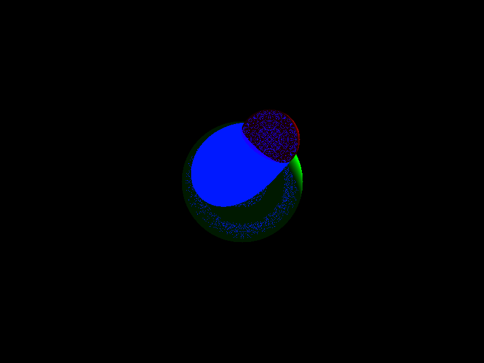
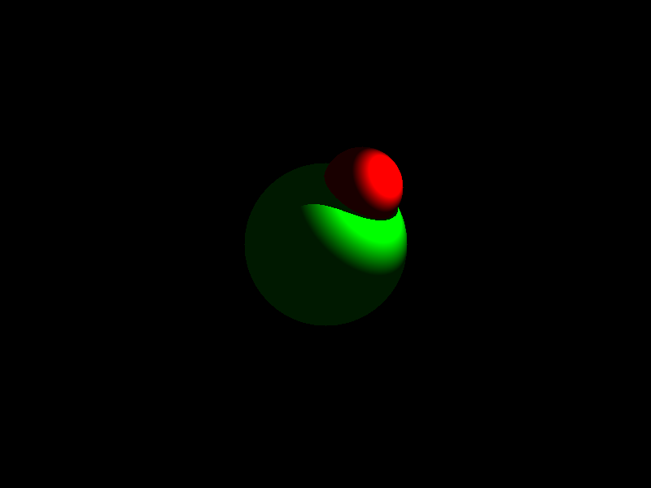
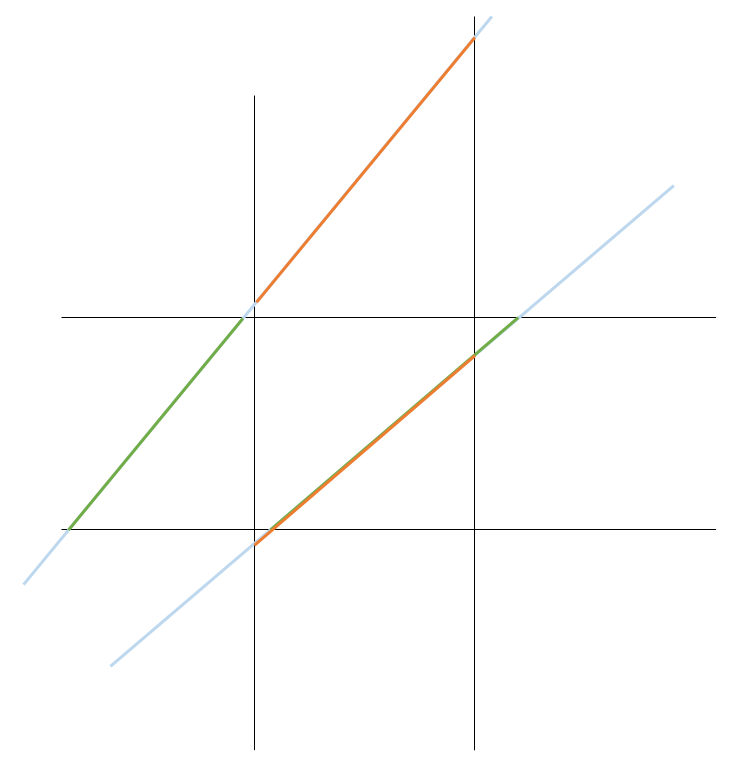
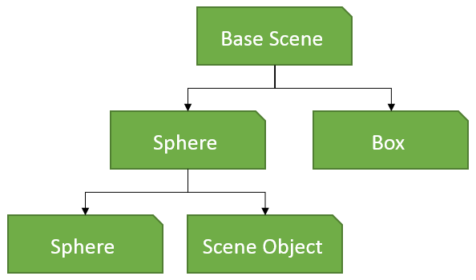

## Introduction

Quite a busy week on a professional point of view, I didn’t get as much free time as I expected. That’s why this chronicle might feel a little bit empty. Without further ado, let's proceed!

## Renderer

### Shadows

Shadows, or at least hard shadows are easy to compute. You only need to know if you can “see” the light source from your current “position”.


As you can see on the above diagram, we fire a second ray from the intersection point [previously obtained](http://thomaspoulet.fr/weekly-part-1-animation-pathtracer-from-scratch/) to the light source. If it hits anything else than the light, the point is in shadow.  



During the debug process, to enhance the shadow effect, I chose to draw them in blue. As we can see there is a lot of false positive organized in pattern around the spheres, this might come from the fact that I use single precision float.  
Here is the final image, with correct shadow color.



### Animation

This week, we have a new animation with shadows. I also made a second scene with the green ball slightly moved back. Each animation (3 second video) is rendered in around 2 minutes 40.  
<iframe width="854" height="510" style="width:100%;" src="https://www.youtube.com/embed/10rdRYlPFQ8?loop=1&playlist=10rdRYlPFQ8" frameborder="0" allowfullscreen></iframe>
<iframe width="854" height="510" style="width:100%;" src="https://www.youtube.com/embed/OeDidPrlsXM?loop=1&playlist=OeDidPrlsXM" frameborder="0" allowfullscreen></iframe>

## Scene Management

### Scene Accelerator

The best way to optimize the rendering time is to reduce the number of calculations you have to do for one frame. One way to do this is by using scene accelerators, one of the easiest to implement is the AABB.  
AABB, or axis aligned bounding box is a box that surrounds the final object allowing us to make faster intersection test.



### Ray – Box Intersection 

Here comes the tricky part. The box, unlike the sphere don’t have an easy way to determine if it’s intersected or not. There is plenty of good methods out there, but they are more or less based on the same, the slab method.  
The idea is to successively clip the ray with a pair of parallel planes for each dimension of the space. We only have to do this three times, for the x, the y and the z axis. In “An efficient and robust ray-box intersection algorithm.” Amy Williams describes a way to speed this process by precomputing values and optimizing tests.  
```cpp
    for ( int i = 0; i < 3; ++i ) {
        if ( pRay.Origin ()[i] >= this->m_lower[i] && pRay.Origin ()[i] <= this->m_upper[i] ) {
            if ( pRay.Direction ()[i] != 1 ) {
                float tNear = (this->m_lower[i] - pRay.Origin ()[i]) * pRay.InvDirection ()[i];
                float tFar = (this->m_upper[i] - pRay.Origin ()[i]) * pRay.InvDirection ()[i];
                if ( tNear > tFar )
                    std::swap ( tNear, tFar );
                t0 = tNear > t0 ? tNear : t0;
                t1 = tFar < t1 ? tFar : t1;

                if ( t0 > t1 )
                    return false;
            }
        }
    }
```
{: .large-content}

Above is the code we use in the renderer, as we can see there are two more tests. The first one test if the ray origin is contained in the box.  

```cpp
pRay.Origin ()[i] >= this->m_lower[i] && pRay.Origin ()[i] <= this->m_upper[i] 
```

The second one test if the ray is parallel to an axis.

```cpp
pRay.Direction ()[i] != 1
```

### Scene tree

From the beginning, I tried to keep performance in mind, that’s why I implemented scene graph. Each and every objects in the scene have a unique parent and zero or more children. Coupled with the Scene accelerator I’m saving a lot of computing power by only testing a minimal number of intersections.  
In the current configuration, with primitives, this is not quite flagrant because each spheres only require one test to get intersection, but in triangle based complex object you would have to test every triangles for every objects.  
A scene object has a bounding box surrounding itself and its children, thus we can recursively test if the ray hits a branch of the tree, leading to effective pruning.



## Next Week

Next will also be a busy week, however I got some small maintenance works to do on the codebase. I also plan to prepare it to add an obj importer.   
## References

Williams, Amy, et al. *"An efficient and robust ray-box intersection algorithm."* ACM SIGGRAPH 2005 Courses. ACM, 2005.

