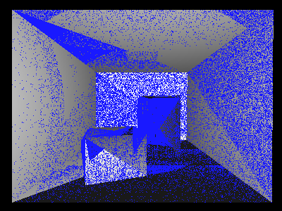
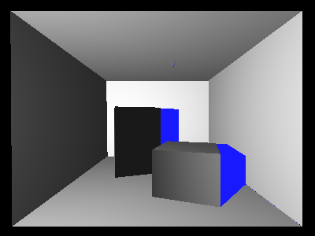
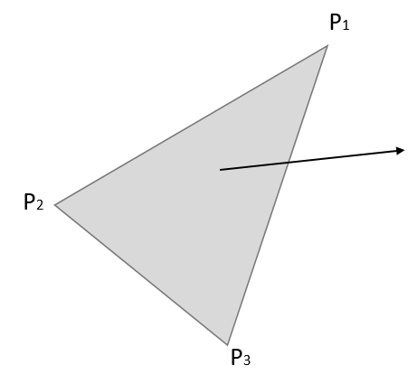
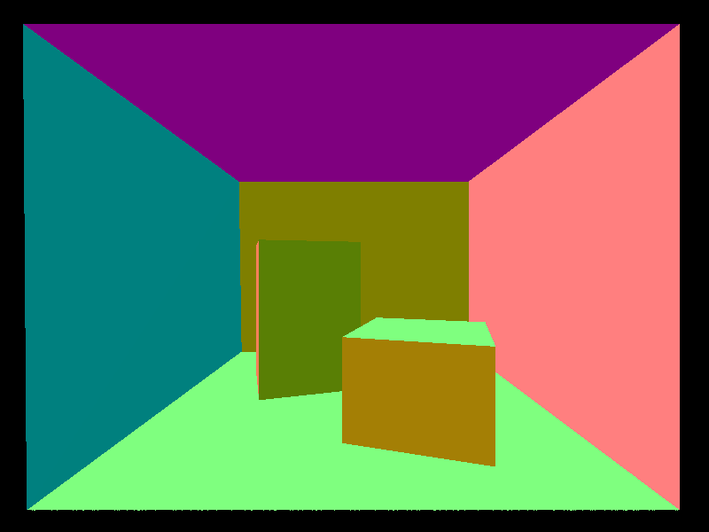
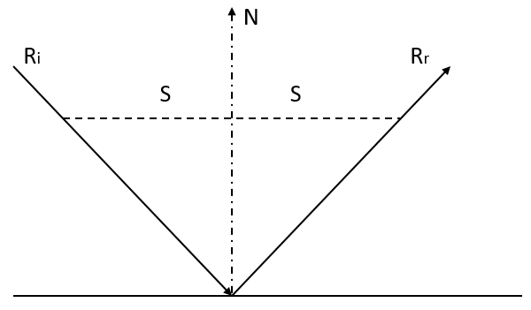

## Introduction
This week is a double chronic one, since I did not publish it last week. It is quite heavy on math but I tried to keep it as simple as possible by breaking every steps into simpler ones.
I’m having great fun writing these chronicles, writing the process that usually stays in the shadow. I’m also hoping that you’re having as much fun reading them. 

## Renderer
### Shadows

Last week I implemented shadows into the tracer. However due to rounding errors I had some bad artifacts on the final images. This problem is known as the surface Acne problem [^1], this paper describes a solution to approximate a new intersection point. I found a simple fix for this particular case by reversing the shadow ray. This way we ensure that the ray is not going to hit the object from inside. The downside of this method is that we can no longer get self-intersection shadows.
The below images shows us the reducing in the amount of shadow artifact.




### Triangle-Ray Intersection

Until this week the renderer was only able to render basic primitives, like balls, well only balls. But if I want, maybe one day, to use it to render something else it must be able to render complex geometries.
There is two basic way for rendering complex geometries: triangles and quads. I chose to go for triangles first. The method I use is based on the work of Möller and Trumbore [^2].
Let’s consider the below equation of a point on a triangle.

$$T(u,v)=(1-u-v)V_{0}+uV_{1}+uV_{2}$$  

We have \\((u,v)\\) the barycentric coordinates of our triangle, thus they must comply with these three rules:  

 * \\(u >= 0\\)
 * \\(v >= 0\\)
 * \\(u+v <= 1\\)

Since we are looking for the intersection between the ray and the triangle we can write:

$$V_{0}+u(V_{1}-V_{0})+v(V_{2}-V_{0})=O+tD$$

By rearranging terms we get:

$$uV_{1}-uV_{0}+vV_{2}-vV_{0}+V_{0}=O+tD$$

$$(-Dt)+((V_{1}-V_{0})u)+((V_{2}-V_{0})v)=O-V_{0}$$

We can write this in the form of a system:

$$ \left\lbrace\begin{array}{l}
-D_{x}t + u(V_{1x}-V_{0x}) + v(V_{2x}-V_{0x}) = O_{x} -V_{0x}\\\\
-D_{y}t + u(V_{1y}-V_{0y}) + v(V_{2y}-V_{0y}) = O_{y} -V_{0y}\\\\
-D_{z}t + u(V_{1z}-V_{0z}) + v(V_{2z}-V_{0z}) = O_{z} -V_{0z}
\end{array}\right.$$

We can solve this system using the Cramer’s rule:

$$ D = \left[\begin{array}{ccc}-D & V_{1}-V_{0} & V_{2}-V_{0}\end{array}\right]$$

$$ D_{x} = \left[\begin{array}{ccc}O-V_{0}& V_{1}-V_{0} & V_{2}-V_{0}\end{array}\right]$$

$$ D_{y} = \left[\begin{array}{ccc}-D & O-V_{0} & V_{2}-V_{0}\end{array}\right]$$

$$ D_{z} = \left[\begin{array}{ccc}-D & V_{1}-V_{0} & O-V_{0}\end{array}\right]$$

$$ \left[\begin{array}{c}t\\\\u\\\\v\end{array}\right]=\frac{1}{\vert D \vert}\left[\begin{array}{c}\vert D_{x} \vert\\\\\vert D_{y} \vert\\\\\vert D_{z} \vert\end{array}\right]$$

$$ \left[\begin{array}{c}t\\\\u\\\\v\end{array}\right]=\frac{1}{\left[\begin{array}{ccc}-D& E_{1}& E_{2}\end{array}\right]}\left[\begin{array}{c}\left[\begin{array}{ccc}T& E_{1}& E_{2}\end{array}\right]\\\\\left[\begin{array}{ccc}-D& T& E_{2}\end{array}\right]\\\\\left[\begin{array}{ccc}-D& E_{1}& T\end{array}\right]\end{array}\right]$$

With:

$$E_{1}=V_{1}-V_{0}$$

$$E_{2}=V_{2}-V_{0}$$

$$T=O-V_{0}$$

We can then test our result with the conditions we enunciated earlier. The \\(t\\) parameters is our distance to the intersection.
As described in the paper I chose to speed up the process by computing terms at the latest moment.

```cpp
	float distance = std::numeric_limits<float>::infinity ();

	Math::Vector3<float> v1 = m_vertices[0];
	Math::Vector3<float> v2 = m_vertices[1];
	Math::Vector3<float> v3 = m_vertices[2];

	Math::Vector3<float> e1 = v2 - v1;
	Math::Vector3<float> e2 = v3 - v1;
	Math::Vector3<float> P = pRay.Direction ().cross ( e2 );
	float divisor = P.dot ( e1 );
	if ( divisor == 0. )
		return false;

	float invdivisor = 1.f / divisor;

	// First barycentric coordinate
	Math::Vector3<float> T = pRay.Origin () - v1;
	float u = P.dot ( T ) * invdivisor;
	if ( u < 0. || u > 1. )
		return false;

	// Second barycentric coordinate
	Math::Vector3<float> Q = T.cross ( e1 );
	float v = Q.dot ( pRay.Direction () ) * invdivisor;
	if ( v < 0. || u + v > 1. )
		return false;

	// Get the distance to the intersection
	float t = Q.dot ( e2 ) * invdivisor;
	if ( t<pRay.Min () || t> pRay.Max () )
		return false;

	if ( distance > t )
		distance = t;

	if ( distance != std::numeric_limits<float>::infinity () )
		return distance;

	return false;
````
{: .large-content}

### Normal Computation

Meshes can be exported with or without normals. In that case you have to compute them before render to save some time. Since a normal is a perpendicular vector to the surface it can easily be computed with cross product of vector.


>Triangle normal

$$N = (P_{2}-P_{1})\times(P_{3}-P_{1})$$

The validity of this result is verified by rendering a special image of normal. The color values are computed as followed:

$$ \left\lbrace\begin{array}{l}
R = \frac{N_{x}-128}{128}\\\\
G = \frac{N_{y}-128}{128}\\\\
B = \frac{N_{z}-128}{128}
\end{array}\right.$$


>Cornell box with normal view

### Reflection

Reflective materials are really easy to compute since the law of reflection says that the angle of incidence is equal to the angle of reflection.



We can write the \\(R_{r}\\) equation:

$$R_{r}= N(-R_{i}.N)+S $$

$$-R_{i}+S= N(-R_{i}.N)+S $$

so

$$R_{r}= -2N(R_{i}.N)+R_{i} $$

Surface Acne is also a problem for reflective materials, this time I chose to slightly move up the intersection point in the direction of the normal.


{: .large-content}
>Custom scene based on the Cornell box with reflection
{: .large-content}

## Scene Management
### Obj Loader

Sphere primitives are fun to render, however it’s a bit monotone in the end. There are plenty of scene formats out there, I chose to use the .obj format for its ease of use and one of its importer: [https://github.com/syoyo/tinyobjloader](https://github.com/syoyo/tinyobjloader). Obj files comes with .mtl files containing material information.
During the initialization the engine loads the file and transpose the scene in memory in our custom format. For the moment, I still haven’t figure out how I could hierarchy organize my scene for the accelerator. Thus, all the scene objects are, for the moment, linked to the first object, leading to really poor AABB accelerator performance.

## Next Week

For next week, I will try to add elements of path tracing to the code. I may also try to finish the refraction model.

## References

[^1]: A. Woo, A. Pearce, and M. Ouellette, “It’s really not a rendering bug, you see,*” IEEE Comput. Graph. Appl.*, vol. 16, no. 5, pp. 21–25, 1996.  
[^2]: T. Moller and B. Trumbore, *“Fast, minimum storage ray-triangle intersection,” Doktorsavhandlingar vid Chalmers Tek. Hogsk.*, no. 1425, pp. 109–115, 1998. 

