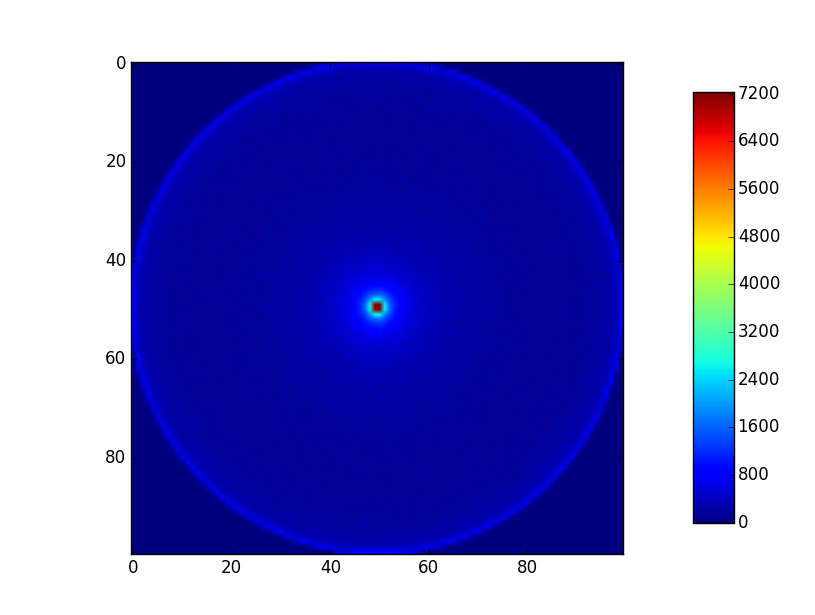

## Introduction

During the rendering process, you will need to sample points over a designated surface. In this first part (meaning there will probably be a second part covering other shapes) I will try to detail sampling on unit disc and hemispheres.
All the examples are generated with two million samples.

## Uniform?

There is two kind of sampling, uniform and non-uniform. Uniform sampling guarantee that all the coordinates have the same probability to be chosen.


>**Figure 1:** Phong Illumination model applied to four different surfaces. From left to right: In perfect mirror conditions incident rays are generated using the law of reflection. In glossy materials, incident rays are generated on the unit Hemisphere with the reflection direction. In pure diffuse conditions, incident rays are sampled uniformly on the unit sphere.

As we can see on *fig. 1* in the case of pure diffuse surface the rays are generated uniformly on the unit hemisphere, meaning that no direction will be preferred over another.  We could use non uniform sampling, but by doing so we would give importance to random directions, leading to artefacts in the final image if not intentional or brighter spots. Pure diffuse surfaces are only theoretical, but they makes a good approximations of what we can find in the real world.

## Hemisphere: Spherical Coordinates

Let’s try the naivest thing we can think of. The below equation is the conversion from spherical coordinates to Cartesian on unit disc.

$$ \left\lbrace\begin{array}{l}
x=r\sin\theta\cos\varphi\\\\
y=r\sin\theta\sin\varphi\\\\
z=r\cos\theta
\end{array}\right.$$

Perfect! We have two variables, phi and theta, we can generate them randomly respectively over  \\([0, \pi]\\), and \\([-\pi, \pi]\\). Theta is generated over \\([0,\pi]\\) to ensure z is positive.

```python
# Generate a random point on a sphere using spherical coordinates
def random_spherical(u, v):
    # Correct Range [0;pi] [-pi;pi]
    theta = u * np.pi
    phi = (v * np.pi * 2) - np.pi

    # Switch to cartesian coordinates
    x = np.sin(theta) * np.cos(phi)
    y = np.sin(theta) * np.sin(phi)

    return x, y
```
{: .large-content}



The code is rather easy, but the result, is disappointing. The sampling is no way near to be uniform, we have a much more populated spot in the middle of the disc.
Back to the drawing board.

## Disc: Rejection Sampling

We can really easily ensure uniform sampling on unit square using standard library functions. Based on this assumptions we can elaborate an algorithm where we only return the points that are inside a circle on this square.

$$d=\sqrt{(x_{b}-x_{a})^{2}+(y_{b}-y_{a})^{2}}$$

With the above equation we get the distance from the centre of the sphere to the point, if it is superior to one then we are outside the unit sphere, we will reject the point.

```python
# Generate a random point on a disc using rejection method
def random_rejection(u, v):
    x = []
    y = []

    # Correct range [-1;1]
    u = 2 * u - 1
    v = 2 * v - 1

    for i, val in enumerate(u):
        r = np.sqrt(np.square(u[i]) + np.square(v[i]))
        if r < 1:
            x.append(u[i])
            y.append(v[i])

    return x, y
```
{: .large-content}


The sampling is good, but we are losing points, let’s evaluates our loss.

$$ \begin{eqnarray}
A_{L} & = & A_{S}-A_{C}\\\\
& = & D^{2}-(\frac{\pi}{4}*D^{2})\\\\
& = & D^{2}-(1-\frac{\pi}{4})\\\\
& = & 1-\frac{\pi}{4}\\\\
& = & 1-0.78\\\\
A_{L} & = & 0.21\\\\
\end{eqnarray}$$

In our case it is not possible to accept a loss of **21%** of our samples every sampling, let’s have a look at another method.

## Disc: Polar Mapping

This method is based on the same principles as the naive approach, we are using the conversion equation from Polar to Cartesian coordinates.

$$ \left\lbrace\begin{array}{l}
x=r\cos\varphi\\\\
y=r\sin\varphi
\end{array}\right.$$

```python
# Generate a random point on a disc using polar coordinates
def random_polar(u, v):
    # Correct Range [-pi;pi] [-pi;pi]
    theta = (u * np.pi * 2) - np.pi
    r = v

    # Switch to cartesian coordinates
    x = r * np.cos(theta)
    y = r * np.sin(theta)

    return x, y
```
{: .large-content}


As we can see on the figure, our sampling is heavily distorted. This comes from the fact that \\( r=\sqrt{x^{2}+y^{2}} \\) is not linear, leading to inner values mapping a larger area than outer values. Again the code is simple, but due to non-uniform repartition, we have to find another method.

## Disc: Concentric Mapping

To correct the flaws described previously in the Polar Mapping technique, Peter Shirley introduced the concentric mapping technique [^1]. It is built around three properties that a good mapping technique should follow.

* Preserve fractional area: This mean that the ration between two areas should remain the same, as shown on the figure.


>**Figure 2:** The concentric map preserve the fractional area, thus \\(A(R)/A(S) = A(m(R))/A(m(S))\\) with m the mapping transformation

* Bicontinuous:  A maps is Bicontinuous if it preserve adjacency between the points. As we saw earlier on, the polar mapping is not Bicontinuous.
* Low Distortion: The mapping technique should preserve as much as possible the overall aspect of the shapes.

To follow these three rules, we define four regions on the square which are mapped to the circle.


>**Figure 3:** The four regions mapped both on the square and the circle using the concentric mapping.

For the first region the equation will be as followed.

$$ \left\lbrace\begin{array}{l}
r=a\\\\
\theta=\frac{\pi}{4}\frac{b}{a}
\end{array}\right.$$

The code is quite simple but use a relatively large numbers of branching, which could be problematic if we need to accomplish a large number of sampling.

```python
# Generate a random point on a hemisphere using Shirley concentric mapping
def random_concentric(u, v):
    x = []
    y = []

    # Correct range [-1;1]
    u = 2 * u - 1
    v = 2 * v - 1

    for i, val in enumerate(u):
        a = u[i]
        b = v[i]

        if a > -b:
            if a > b:  # Region 1
                r = a
                phi = (np.pi / 4) * (b / a)
            else:  # Region 2
                r = b
                phi = (np.pi / 4) * (2 - (a / b))
        else:
            if a < b:  # Region 3
                r = -a
                phi = (np.pi / 4) * (4 + (b / a))
            else:  # Region 4
                r = -b
                if b != 0:
                    phi = (np.pi / 4) * (6 - (a / b))
                else:
                    phi = 0

        x.append(r * np.cos(phi))
        y.append(r * np.sin(phi))

    return x, y
```
{: .large-content}


The result is a uniform sampling on the disk with low distortion, nor loss of samples. This method is quite well suited for our needs, but we can do even better!

## Hemisphere: Cosine Weighted Sampling

The goal of this technique is to map a square to a disk using a cosine power distribution to choose the shape and the density of distribution.


If you remember the introduction, the Phong Illumination uses a uniform and a spiky part for the reflection, the cosine power is perfectly suited for this spiky effect. But as we can see on the figure, we can also produce uniform distribution with zero power.

$$ \theta=\arccos((1-u)^{\frac{1}{1+p}})$$

This equation is not looking good, and we can have good reasons to think that it may take long to compute. But if we take the equation and place it in its context, we can reduce the amount of operations needed using some trigonometric relationship.

$$ \begin{eqnarray}
\theta & = & \arccos((1-u)^{\frac{1}{1+p}}) \\\\
\sin\theta & = & \sin(\arccos((1-u)^{\frac{1}{1+p}})) \\\\
 & = & \sqrt{1-((1-u)^{\frac{1}{1+p}}))^{2}}\end{eqnarray}$$

For \\(p=0\\) or uniform sampling:

$$ \begin{eqnarray}
\sin\theta_{0} & = & \sqrt{1-((1-u)^{\frac{1}{1+0}}))^{2}} \\\\
& = & \sqrt{1-(1-y)^{2}}\\\\
\sin\theta_{0} & = & \sqrt{-y(y-2)}\\\\
\end{eqnarray}$$

Using the optimized form the computation is done in *0.1040 second* versus *0.1721 second* for the general arccos form. This simple arithmetic optimization can lead to dramatic rendering time saving since we make an extensive use of this function during the tracing.

```python
# Generate a random point on a hemisphere using power cosine
def random_cosine(u, v, m=1):
    theta = np.arccos(np.power(1 - u, 1 / (1 + m)))
    phi = 2 * np.pi * v

    # Switch to cartesian coordinates
    x = np.sin(theta) * np.cos(phi)
    y = np.sin(theta) * np.sin(phi)

    return x, y
```
{: .large-content}


>The result may seem non-uniform but it is due to the uncorrected disk sphere projection

As we can see on the figure the result a uniform sampling on a unit hemisphere. However by varying the power we can modify the distribution and obtain the effect in the Phong Algorithm. Here is some examples for 5 and 50.


## Conclusion
We now have to valid solutions to generate uniform sampling on unit disk and hemisphere. As a conclusion here is a figure showing all the methods's results.


{: .large-content}
> From left to right, top to bottom

The code is available in Python on Github under the MIT license: [https://github.com/Lord-Nazdar/Sampling-Python](https://github.com/Lord-Nazdar/Sampling-Python).

## References

[^1]: P. Shirley and K. Chiu, “A Low Distortion Map Between Disk and Square,” J. Graph. Tools, vol. 2, no. 3, pp. 45–52, 1997.
