Movie Barcode is a thing that always excited my curiosity, but for whatever reasons I never actually tried to generate one myself.
Few days ago reappeared on [r/dataisbeatiful](https://www.reddit.com/r/dataisbeautiful/comments/3rb8zi/the_average_color_of_every_frame_of_a_given_movie/) a thread about movie barcodes, as I was looking for a new python project I decided to take a shot at it.
This post-mortem will be divided into two parts, the first one about frame preparation and the second one about color detection. As a conclusion I will go through an analysis of Toy Story’s results. 

## Introduction

### What is a Movie Barcode?

A Movie Barcode is the color identity card of the movie. Basically for each frame you take the dominant color and create a stripe out of it. 
The result is an overview of the overall mood of the movie.

### Different methods

Basically there is two methods to generate these barcodes.
The first one consist in squeezing the frames to the desired width. During this phase the reduction algorithm applied will do an average of every pixels in the row. This method keeps the vertical relief, leading to non-homogenous results in slices, as we can see on the example below. 


{: .large-content}
>**Toy Story (1995)** - [moviebarcode.tumblr.com](http://moviebarcode.tumblr.com/post/4578219878/toy-story-1995-prints)
{: .large-content}

Best examples of this method can be found there: [http://moviebarcode.tumblr.com/](http://moviebarcode.tumblr.com/)

The second method consist in extracting the dominant or primary color of the frame, and then applying it to the slice. This method allows me to have a deeper control of the algorithm I choose, to extract the primary color. The final image is a lot smoother than the ones generated with the first method, as we can see below with the same movie.

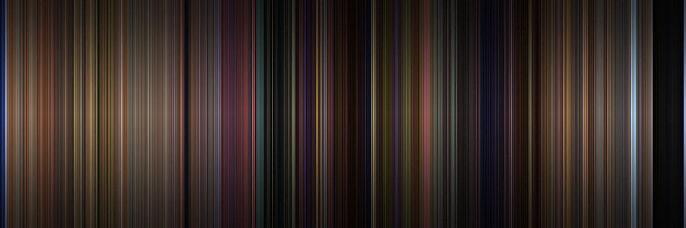
{: .large-content}
>**Toy Story (1995)** – Internal
{: .large-content}

I decided to use the second method, since I preferred the more polished look. Also it’s an incredible opportunity for me to test different color extraction processes.

### Note

The code is fully available on [Github](https://github.com/Lord-Nazdar/MovieBarcode) under the MIT License. Do not hesitate to try it by yourself and share your images in the issues!

## Preparation

For evident reasons, during the development process I was not using full length clips, I was working with Youtube trailers. The quality is awful but at least the clip is short and the weight reduced, perfect for prototyping. However, these clips have a major downside, they regularly featured black borders coming from different screen formats.
When you are trying to extract the primary color of an image, having one third of it plunged into complete darkness doesn’t really makes it. Thus, before extracting any colors I need to crop the frames.

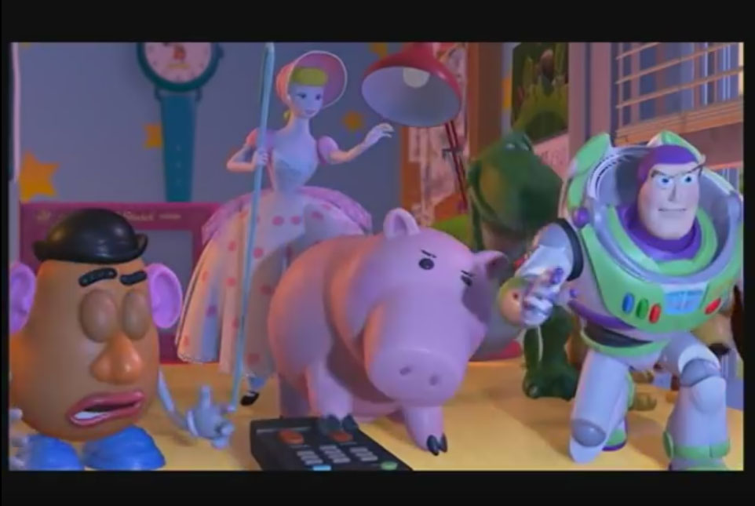
>**Toy Story 2 (1999)** - Black Borders issue

In first place I tried to detect the borders using edge detection gradients like Prewitt[^1] or Sobel in combination with Hough Line Detector. With Sobel kernel we can define the orientation, thus keeping only edges in roughly the right direction. We can see below the formulas as well as the results images.

$$\mathbf{S\_x} = \begin{bmatrix} -1 & 0 & 1 \\\ -2 & 0 & 2 \\\ -1 & 0 & 1 \end{bmatrix}
\quad\quad 
\mathbf{S\_y} = \begin{bmatrix} -1 & -2 & -1 \\\ 0 & 0 & 0 \\\ 1 & 2 & 1 \end{bmatrix}$$


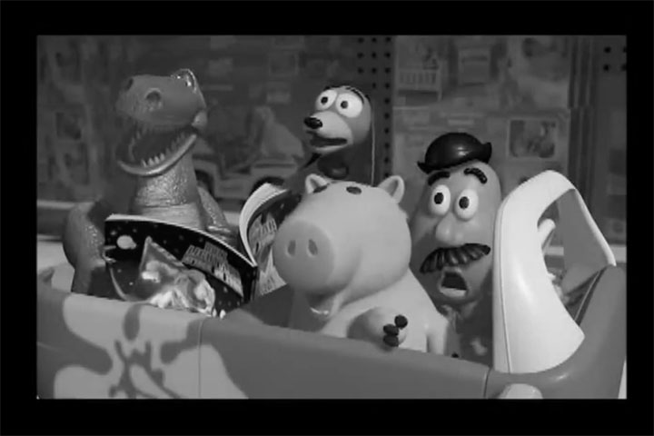
>**Toy Story 2 (1999)** - Original Image before Sobel

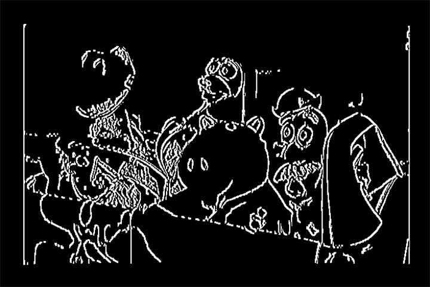
>**Toy Story 2 (1999)** - Image after Sobel X

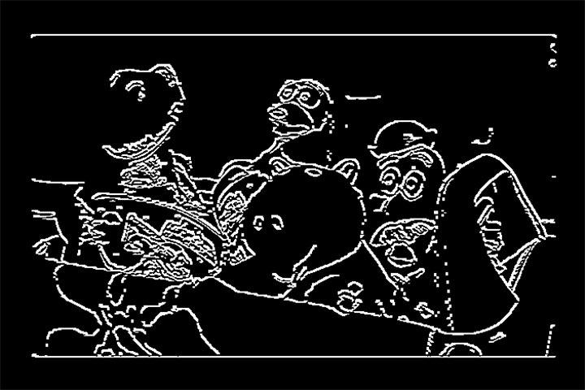
>**Toy Story 2 (1999)** - Image after Sobel Y

These images are then plugged into a Hough[^2] Detector to extract lines. The result I obtained was not really convincing, lots of noises and false positives.
Before completely scrapping this branch, I tried to replace my Sobel operator with Canny’s[^3] one, and the result was way better. Canny’s operator produce much more sharper and precise edge images, especially for geometric images.

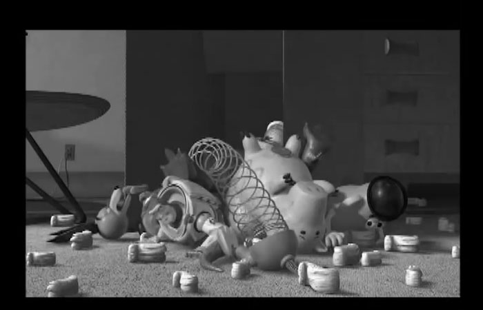
>**Toy Story 2 (1999)** - Original Clip with Black Borders

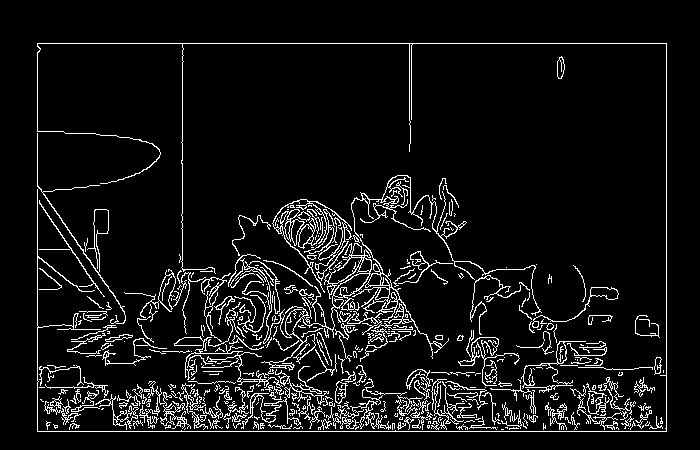
>**Toy Story 2 (1999)** - Same frame after Canny Filter

The above result is perfect for Hough detection, and it worked well. For whatever silly reasons I decided to detect the edges for each and every frame, leading to awful performances, the Hough detector requiring a lot of computation.
So was it for Hough, I decided to find another way to detect the edges. Since I was sure that they were vertical or horizontal, I chose to sum each rows or columns individually until I reached a maximum. These maximums are my border edges. I later optimized it by only going through each half once, because I was confident enough that edges could only be in their own half.

```python
def iterate_vertical(dim1, dim2, width, frame, default):
    max_sum = 0
    y = 0
    for i in range(dim1, dim2):
        temp_sum = 0

        for j in range(0, width):
            temp_sum += frame[i][j]

        if temp_sum > max_sum:
            max_sum = temp_sum
            y = i

    # Only if we have a line long enough
    if max_sum/255 > width/2:
        return y
    else:
        return default


def iterate_horizontal(dim1, dim2, height, frame, default):
    max_sum = 0
    x = 0
    for i in range(dim1, dim2):
        temp_sum = 0

        for j in range(0, height):
            temp_sum += frame[j][i]

        if temp_sum > max_sum:
            max_sum = temp_sum
            x = i

    # Only if we have a line long enough
    if max_sum/255 > height/2:
        return x
    else:
        return default
```
{: .large-content}

This algorithm is also capable to not detect borders in images without them, I will then return zero. However some images can lead to incorrect results.

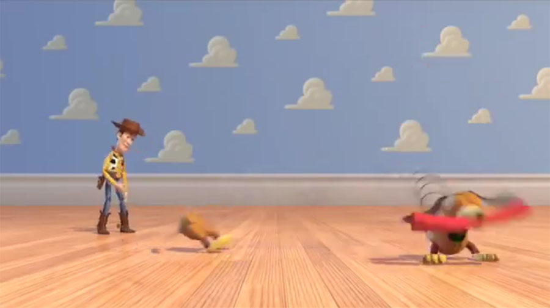
>**Toy Story 3 (2010)** - The straight line in the middle is causing the algorithm to detect a border

To reduce the risk of false positive, the algorithm is run over a test population of five frames, then I take the median of the results. This ensure me that black frames or detection failures will not alter the final result. I am still not detecting the example above.

## Frame Processing

### Average

Now for each frame we need to detect its primary color. The most commonly used technique is the average one.
This method is really straightforward, and as indicated by its name, it makes an average of every pixel’s values.
The result is the average color of the image, and not the dominant nor primary one. This can lead to some errors as can see below.

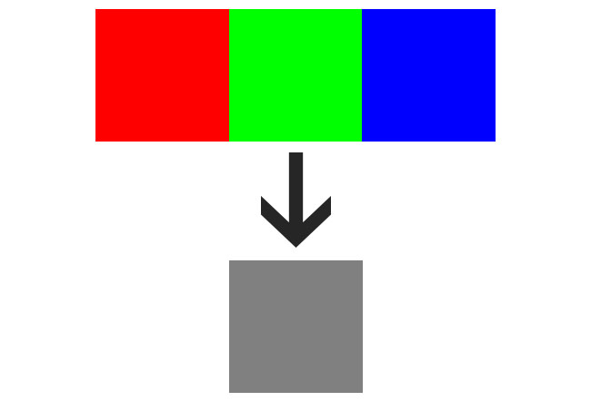

However, this method can still produce some decent results, since images are not composed of perfectly opposed colors.


>**Color Circle** - [Wikimedia](https://commons.wikimedia.org/wiki/File:Color_circle_(hue-sat).png)

### Histograms

>"It serve the purpose to roughly assess the probability distribution of a given variable by depicting the frequencies of observations occurring in certain ranges of values

Based on this definition found on Wikipedia, the application in imagery can easily be identified. We can get the color repartition of the image, by simply summing the channels.

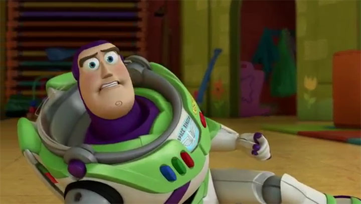
>**Toy Story 3 (2010)** - Original image used for both histograms

There are multiple ways to represent color in an image. The obvious one is the RGB system as in Red Green and Blue. Each pixel’s color is composed out of these three basic colors.


>**RGB Histogram** - With the color corresponding to its channel the image, by simply summing the channels

With this histogram we can identify the dominant color by selecting the peaks for each channel. For some cases this method will not work, since RGB system represent colors by decomposing them.
There is another way to represent colors, HSV as in Hue Saturation and Value. In this system the full color spectrum is defined in the Hue. Meaning that if we get the peak in hue we should get the dominant color.


>**HSV Histogram** - With Red as Hue ranging clockwise (red, yellow, green, cyan, blue, magenta), Black as the Saturation, and  Magenta as the Value

In the current implementation these methods are highly influenced by noise. In fact, we are only looking for perfectly identical shades. This issue can be addressed by preprocessing the frame to remove the noise, or taking a wider slice of the histogram when evaluating the maximum.

### K-Means

For the last method I decided to reduce the number of similar colors by applying a K-Means clustering[^4].

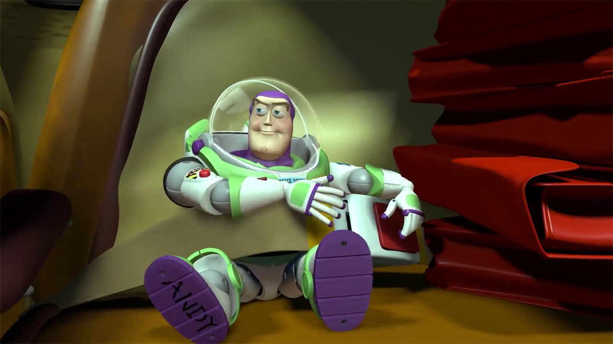
>'**Toy Story (1995)** - Original Image

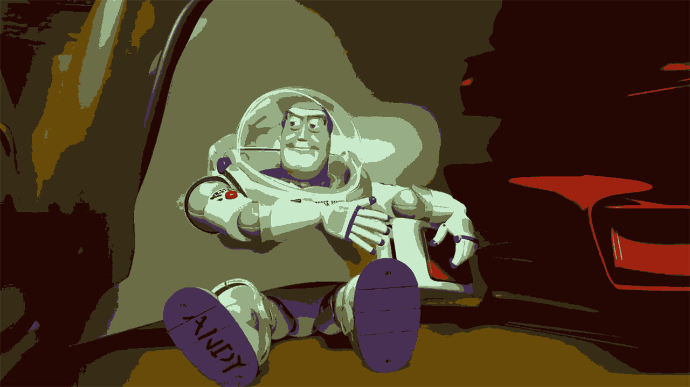
>**Toy Story (1995)** - Result after KMeans with eight centroids (colors)

The K-Means algorithm will try to reduce the number of possible values by grouping similar colors. This method allows me to select the number of groups I want to have. A lots of groups may lead to ineffective filtering by dividing too much the colors and too few can cause merging of very different colors. In my implementation I decided to use eight centroids.

## Results Analysis

Before examining the results, I just want to compare the four different methods used to extract the dominant color.

<table style="width: 100%; text-align: center;">
  <tr>
    <th></th>
    <th>Average<br></th>
    <th>RGB</th>
    <th>HSV</th>
    <th>K-Means</th>
  </tr>
  <tr>
    <td>Speed</td>
    <td>***</td>
    <td>**</td>
    <td>**</td>
    <td>*</td>
  </tr>
  <tr>
    <td>Complexity</td>
    <td>***</td>
    <td>***</td>
    <td>**</td>
    <td>*</td>
  </tr>
  <tr>
    <td>Fidelity</td>
    <td>*</td>
    <td>*</td>
    <td>**</td>
    <td>***</td>
  </tr>
</table>

For the moment the program is not threaded, but since each frame processing is independent one another, it would be very easy to accomplish. 
On a 4.0GHz i7 computer, a 720p movie processing using average, RGB, or HSV is around eight minutes. Due to the higher computational cost of the K-Means, the processing is around one hour.


{: .large-content}
>**Toy Story (1995)** - Comparison of the four methods with highlight points
{: .large-content}

As we can see the K-Means method tends to produce much sharper results, especially in exteriors (9). This result is due to the fact that the camera is aiming at woody and buzz, and at the sky, in this kind of situation the K-Means may group the sky with the leaves or the leaves with the ground depending on the context.
Buzz’s eviction takes place during dusk, the scenery is deeply influenced by the orange tint. This can only be observed using the average method, the other methods are trying to identify one dominant color, which in this case is the purple penumbra of the room. 

## Conclusion

In the overhaul, the average method gives us a much smoother result that can even be considered as more relevant. It is not only considering the particularity of a frame, but capturing the scene mood. However this method is still not perfect, the colors lacks of intensity since they are mixed with each other.

## References

[^1]: J. Prewitt, “Object enhancement and extraction,” Picture processing and Psychopictorics, vol. 10, no. 1. pp. 15–19, 1970.
[^2]: P. V. C. Hough, “Method and means for recognizing complex patterns,” US Pat. 3,069,654, vol. 21, pp. 225–231, 1962.
[^3]: J. Canny, “A computational approach to edge detection.,” IEEE Trans. Pattern Anal. Mach. Intell., vol. 8, no. 6, pp. 679–698, 1986.
[^4]: J. B. MacQueen, “Kmeans Some Methods for classification and Analysis of Multivariate Observations,” 5th Berkeley Symp. Math. Stat. Probab. 1967, vol. 1, no. 233, pp. 281–297, 1967.
