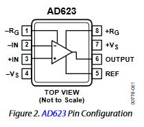
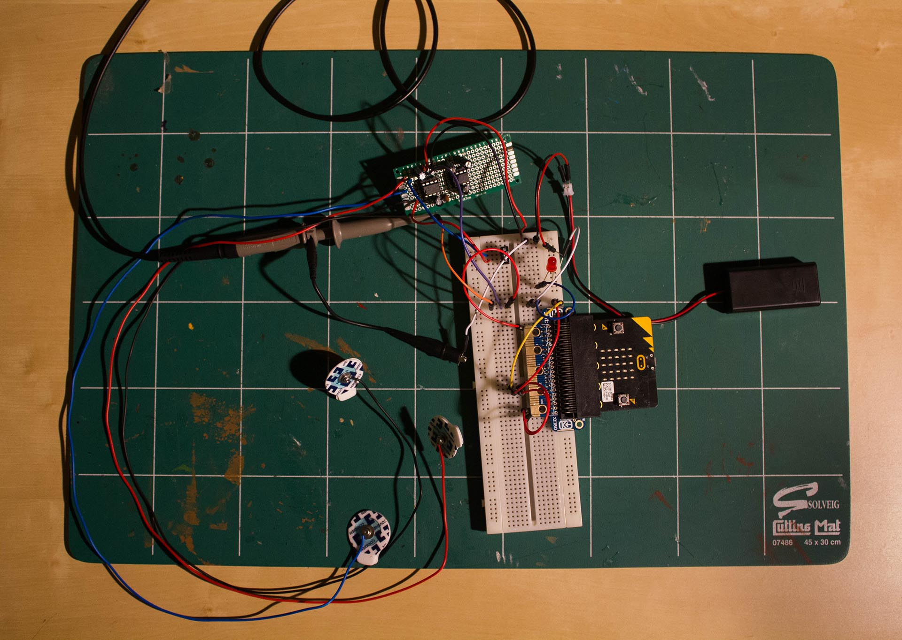

## Introduction

In the context of a recent challenge I took part, I needed to design a portable EMG device using the [BBC micro:bit](http://microbit.org/) as its main processing board. Current EMG solutions being often quite pricy and usually not adapted to personal usage, we decided to lower the entry barrier of this technology, and try to make it accessible to more people over the world. 

This project was conducted as part of a challenge organized by ARM Ltd. It was done in collaboration with George Kopanas and [Michalis Spyrou](https://github.com/mpekatsoula). 

## What is an EMG? 

> Electromyography (EMG) is an electrodiagnostic medicine technique for evaluating and recording the electrical activity produced by skeletal muscles.  
> [Wikipedia](https://en.wikipedia.org/wiki/Electromyography)

In short, non-exact, and very nonscientific way, it is a way to plot the effort you are producing by contracting your muscles. EMG goes along ECG and EEG, respectively a way to measure hearth activity and brain activity. 

There are two main ways to do EMG. The first one is intramuscular and is done by inserting a needle electrode under the skin, although it allows for better accuracy and better readings the setup is complex and is not suited for continuous measurement. The second method is using electrodes placed on the skin. The quality of the readings will vary based on the quality of the electrodes and the conductive solution used between the electrode and the skin, but this solution is better for unsupervised and outdoor use.

## Specification 

Before diving in head first, we need to analyze the situation and understand what we will be measuring and how we will be doing it. One, if not the main point of this project was to make EMG accessible to the masses, if needle based acquisition give better readings we ruled this option out as it would have been too complex, and would have required medical supervision to use it. Furthermore, needle electrodes are harder to obtain compared to simple gel electrodes.

Knowing which kind of electrodes we were going to use, we then had to identify what we were about to measure, where to find it, and in what amplitude. After a quick look around research papers [^1] and different other sources, we saw that we were looking at a signal with amplitude between tens of μV and few odd mV. Can we use this signal directly in our micro:bit ADC (Analog Digital Converter)? Let’s do the math.

The ADC is sampling over a range of \\([0V;3V]\\), with a precision of 10 bits, meaning 1024 possible different values. 

$$  \frac{3}{1024} = 2.92\times10^{-3} \simeq 3mV $$

Thus, a difference in 1 in our ADC output would mean that our signal changed by about 3mV. In our case, even the best signal that we could get might not even be able to modify the ADC output. We need to amplify our electrode signal. 

We wanted this device to be easily used outside a lab, for example to monitor live outdoors exercise. The micro:bit itself being quite small, we fixed our self the constraint that the design should fit in the same or smaller form factor to be easily attached to the back of it. Finally, our last constraint was budget; the challenge had a hard limit of £20, although this limit can seem quite low for such a product, it’s a criterion that can rule if a device of this kind can be successful in reaching the masses. 

With all that in mind we can start drafting what our system would look like: 

* Amplification (around 100 times) 
* Wearable 
* Low power consumption 
* Low price point 

## Amplification 

Our device is all about amplification, or how to get our few mV to occupy most of our \\([0V;3V]\\) range. There are two major ways we could do this amplification. The first one would be to blindly amplify the signal picked up by one of the electrode. The main problem of this method is that we are going to amplify the base voltage and, thus we might miss the actual interesting part of the signal. 
The second way to proceed would be to use a differential amplifier. The concept is simple, differential amplifiers takes two inputs subtract them and amplify the result.

$$ V_{out} = A * (V_A - V_B) $$

In our case, one of the electrodes is placed in the middle of the studied muscle and the other one near one of its extremity. 

### Choosing the amplifier 

Now that we know what kind of amplification we are looking at, we need to choose the part. Our price point and form factor were a real challenge while looking for parts, so I started by filtering for through holes DIP-packages instrumentation amplifiers, sorting from low to high price. 

Then I looked for our second criterion. For ease of use the amplifier should have a variable gain that can be set by using a resistor. That let us with a choice between the AD600 series from Analog Devices and the INA120 from Texas Instruments, and more precisely the AD623 and the INA126. In the end I decided to go with the AD623 as it better matched our requirements and expectations. 

{: .auto-content}

The AD623 is really simple to use, in order to set your desired amplification ratio you simply need to hook up a resistor between its pin 1 and 8. The value of this resistor is then chosen using the following formula:

$$ V_{out}  = \left ( 1 + \frac{100 k\Omega}{R_G} \right )V_C $$

## Negative rail 

The signal we are picking up is alternating between negative and positive. To minimize the loss in information I decided to amplify the full range and then block the negative part using a diode. Thus we needed to provide our amplifier with a negative rail. 

To do this I decided to use the MAX1044 a Switched-Capacitor Voltage Converter, since I successfully used multiple times in the past. By simply using one capacitor we can generate stable negative voltage, without having to think about asymmetry between the positive and negative rails. One limitation is that its performance drop drastically in case of high current requirements, which is not our case.

## Schematic 

With all the big parts selected it is now time to create the schematic. 

Nothing fancy here, just the bare minimum to get the system running with a decent signal integrity. 

## Prototype 

In order to do some testing I wired everything onto a small matrix PCB, for a first time using matrix PCB the result is not too bad, but things could have gone way more smoothly. 

{: .large-content}

The first test was done using a fixed resistor of 1k ohms. This was mostly inconclusive as we found out that the correct amplification value was highly dependent of the subject, the muscle, and the electrode position.

In the current version, we changed it by a potentiometer of 1.5k Ohms.

{: .large-content}

## References
[^1]: E. Vavrinský et al., "Design of EMG wireless sensor system," 2011 International Conference on Applied Electronics, Pilsen, 2011, pp. 1-4.
