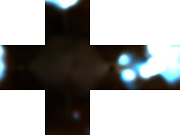

## Introduction

The Witness came out in 2016, and for me it was a real blast from the past, from when I was spending countless hours on point on clicks games. The Witness was giving me that sense of being lost in a world without knowing what I was doing, nor why I was doing it. A feeling that I first experienced in the Miller brothers' games, Myst.

The Witness drops the player in a world without much explanation, to progress, he needs to find its way around, solving puzzle by making a path between two points in accordance to some contextual rules. Its very distinctive art style, in a world of photorealism, and its always spot on gameplay made it a direct success for both players and critics.

{: .large-content}

{: .large-content}

The Witness is not using any mainstream engine such as Unity or Unreal Engine, this motivated me even more to do that analysis. The development team throughout the development ran several detailed [technical blogs](http://the-witness.net/news/category/engine-tech/) that I will refer to during this article. I encourage you to have a look at them in more details if you are interested.

I will look here at the PC version using DirectX 11, several other versions have now been released on PlayStation 4, Xbox One, Android, iOS, and macOS.

Spoiler Alert: Although I tried to keep the level of spoiler to an absolute minimum I might still involuntarily give some clues about some secrets of the game.

Finally, if you haven't played it yet, I do encourage you to do so. The game is available on [GOG.com](https://www.gog.com/game/the_witness) DRM free, [Humble Bundle](https://www.humblebundle.com/store/the-witness) both steam and DRM free, and [Steam](http://store.steampowered.com/app/210970/The_Witness/). So now without further ado, let’s jump right into it.

## The Frame Timeline

This is the frame we will look at, the pond is in the central part of the island between the castle, the town, and the quarry. For the first part of this analysis we will look at this frame at the highest quality setting.

{: .large-content}

{: .large-content}

This frame is rendered in around 5500 draw calls, divided up in 24 render passes. This final number may vary a bit between frames, but I will come back on these special cases further down in the analysis.

## Cascaded shadow maps

Rendering the shadow map is the first step in the rendering pipeline of The Witness. The shadow map is rendered using the CSM *(Cascaded Shadow Map)* technique. The goal of a CSM approach is to render the highest shadow quality possible but only where is matters the most: around the player. Shadows further away from the camera will see their resolution drop to save storage space.

The Witness is rendering four levels of shadow map, each level is rendered onto a square texture of 1024x1024, these textures being packed onto a 4096x1024 single channel buffer of 16bits.


Shadows in the Witness are often part of puzzles, as such each four levels are updated every frame. That can be quite computationally intensive, but The Witness got some neat tricks to reduce a bit the load. Only the first two levels, where frustum culling is the most effective due to the very limited field of view, are fully dynamic. In this frame the first level is rendered in 6 draw calls and the second around 150. The last two are doing even better, by using a pre-rendered shadow map of the island. This high-resolution texture of 8k is just missing the dynamic objects that will be rendered on top.


Objects that do have some transparency are rendered using a custom pixel shader which will discard any pixel with a value inferior to 0.5.

{: .large-content}
```nasm
sample_b r0.xyzw, v0.xyxx, sampler0.xyzw, sampler0, l(-2.000000)
lt r0.x, r0.w, l(0.500000)
discard_nz r0.x
ret
```
{: .large-content}

One of the downside of cascaded shadow maps is that seams where the transition between two level happens. Thankfully this effect is kept to a minimum in The Witness. You can see this it in action in the following screenshot, the shadow of the scaffolding becomes slightly blurrier in the middle.

{: .large-content}

{: .large-content}

As I said, the team tried to keep a dev blog during the development of the game, but the content is often sparse and usually promote a part 2 that never came. In the case of the shadow map, Jonathan Blow wrote two articles ([here](http://the-witness.net/news/2010/03/graphics-tech-shadow-maps-part-1/) and [here](http://the-witness.net/news/2010/04/graphics-tech-shadow-maps-part-2-save-25-texture-memory-and-possibly-much-more/)), detailing the way they generate and pack the shadow maps to save graphics memory. During my analysis I couldn't find any evidence of this technique still being used.

## Global illumination



For global illumination, the game is relying on a set of probes scattered around the levels. These 64x64 cubemaps are rendered offline, and are sampled during the rendering to get the amount and color of the light that has been bounced back.

These probes are, however, not used for reflection as a full pass is dedicated to real time planar reflection.

## Reflection

Another key element of The Witness visual identity, alongside high detailed shadows, is sharp high-resolution reflections. Each body of water, large or small have perfectly sharp reflection on them.

To achieve this, a full render pass in the pipeline is actually dedicated to planar reflection. The scene is rendered from a camera embedded in the ground, mirrored version, to the ground plane, of the main camera.

{: .large-content}

{: .large-content}

There are multiple things to note here. First the scene is rendered twice in a single render pass. The first half of the render pass, is dedicated only to writing depth and stencil. During the second half, the pixels are shaded, but this time only the visible pixels, obtained through a GreaterEqual test against the previously generated depth map, are considered. This can save a lot of computation, especially when the shaders are computationally heavy.

## Scene Rendering

Next stop is the rendering of the scene Just like the reflection map, the engine is first rendering the depth buffer and then the color texture. The scene is rendered on an HDR buffer, **R11G11B10**, of the screen size.

{: .large-content}

{: .large-content}

As we have seen in the previous part, the depth is written first, to discard more efficiently the pixels that will be occluded, thus saving computation. The Witness is also using a logarithmic reversed Z buffer to fight the lack of precision of floating point number as they get closer to zero.


Just like the previous pass, the stencil is also written. It is still unclear to me when the stencil mask is really coming into action, but it is not saved nor passed to any other pass. My guess would be on a way to refine and eliminate objects that are further away from the player using stencil masking.


This render pass, as for many others, is done with 4xMSAA enabled. The anti-aliasing is then further refined with a full post-processing pass dedicated to FXAA.
Note that at this point in time, the scene doesn’t have any water, nor transparent surfaces. They will be added later in another pass.

## Water

Along the coast, around rocks, and other elements in the water, The Witness is adding foam, to further increase the realism. This effect is rendered onto a single channel half resolution buffer.


Next step, the engine renders the water planes in the main scene. Using the previously rendered reflection, and the water details from the previous render pass.

{: .large-content}

{: .large-content}

Note that for now clouds are still missing from the scene even though they have been rendered in the reflection. The next render pass will add them and other various effects to the scene.

## Clouds & VFX Rendering

Working back on the main scene buffer, the final details are finally drawn. First the clouds are added to the scene, and the various effects such as the light rays. Finally, the water splashes are added, and that’s it for our main render.

{: .large-content}

{: .large-content}

## Luminance extraction

Up until now, most of the render targets have been HDR buffers, meaning that they encode the image information with much more precision than what our screens can display (well, most of them anyway).

That also mean that a transformation needs to be applied in order to convert from HDR to LDR. As we will see, the tone mapper used in The Witness is using the luminance information of the scene to get the required nuance between dark and bright areas.

The luminance value is extracted by successively down sampling, by a factor of 4, the rendered scene, until it gets to a single pixel image. This is effectively doing an average of the luminance across the whole frame.


It is interesting to see that the image used to extract the luminance is also taking into account the same vignetting that will be applied on the final image.

## Bloom

Bloom in The Witness is done in a really traditional fashion. It all starts with the darkening of the the downscaled version of the final antialiased scene.

{: .large-content}

{: .large-content}

Two passes of Gaussian blur are then applied on this darken buffer; one along the x-axis and a second along the y-axis. The blur is applied on HDR textures of 480x270, one fourth of the original resolution.

{: .large-content}


{: .large-content}

## Tone Mapping

The last step of the pipeline consists in putting together the bloom and the final render and converting our HDR scene into an LDR one encoded on three single byte channels ready to be put on the screen.
For tone mapping, the team behind The Witness chose the common ["Uncharted 2" equation developed by John Hable](http://filmicworlds.com/blog/filmic-tonemapping-operators/) for the game. The equation goes like this:

{: .large-content}
>(x(Ax+BC)+DE) / (x(Ax+B)+DF) - (E/F)
{: .large-content}

We can easily find this equation by looking at the disassembled shader code:

{: .large-content}
```nasm
15: mul r1.y, cb1_v1.x, cb1_v2.x
[...]
23: div r1.z, cb1_v4.x, cb1_v5.x
24: mad r1.y, cb1_v0.x, cb1_v6.x, r1.y
25: mad r1.y, cb1_v6.x, r1.y, r1.w
26: mad r1.w, cb1_v0.x, cb1_v6.x, cb1_v1.x
27: mad r1.w, cb1_v6.x, r1.w, r2.y

28: div r1.y, r1.y, r1.w

29: add r1.xy, -r1.zzzz, r1.xyxx
```
{: .large-content}

Tracing back the registers we have:

{: .large-content}
```nasm
15: B * C
[...]
23: E / F
24: (A * x) + (B * C)
25: (x * ((A * x) + (B * C)) ) + (D * E)
26: (A * x) + B
27: (x * ((A * x) + B)) + (D* F)

28: ((x * ((A * x) + (B * C)) ) + (D * E)) / ((x * ((A * x) + B)) + (D * F))

29: ((x * ((A * x) + (B * C)) ) + (D * E)) / ((x * ((A * x) + B)) + (D * F)) - (E / F)
```
{: .large-content}

And here we have the full equation. Applying the above equation and we have the final frame nicely rendered and ready to be put on the screen.

{: .large-content}

{: .large-content}

## Puzzles

At the beginning of this article, I stated that the rendering of the CSM was the first step in the pipeline. Well, that is true, except in one case: when the player is interacting with a framed puzzle.

The puzzle is rendered in its own dedicated render passes, three to be exact. During the first one, the guiding lines and board objects are rendered. Next the user path is rendered, and finally both are put together on the final texture. The final texture is then mipmapped and stored to be used later.


The path is rendered using succession of, one square long rectangles and a circle at the end, as can be seen on the image below.


Once the puzzle is completed, and the user is no longer interacting with it, the final texture is saved and used as is in future views where this puzzle is visible. It is interesting to note that the puzzles are all rendered upside down.

## Conclusion

That concludes the analysis for this scene. In part 2, we will discuss some techniques that were not visible in this render. That includes:
 * Texture blending
 * Indoor shadows
 * Tinted windows
 * LOD
 * Graphics Settings
