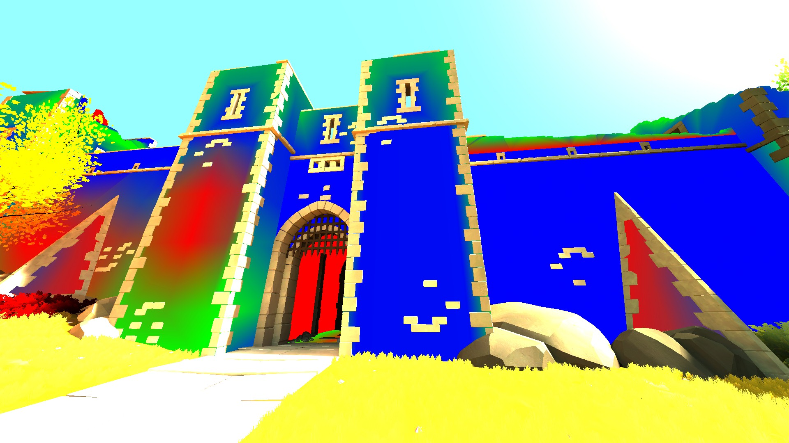
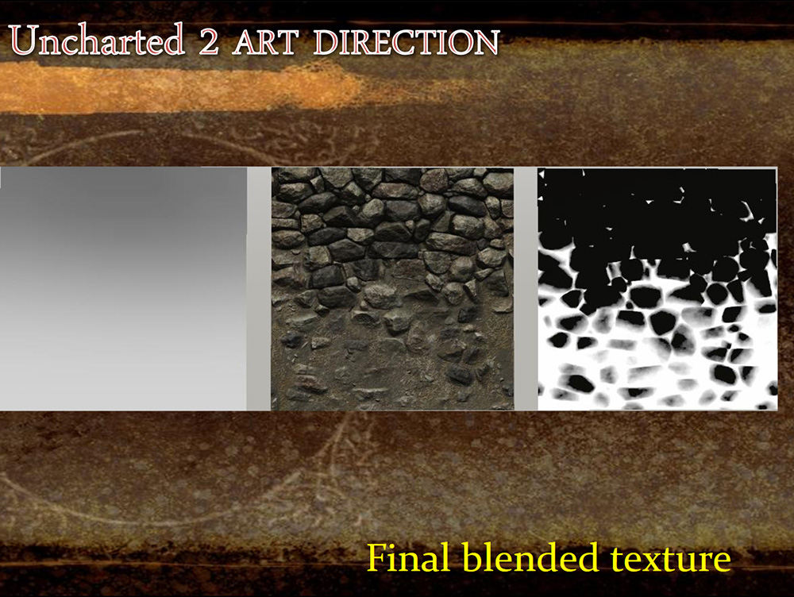
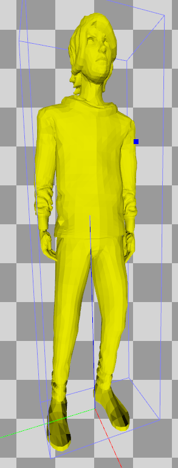
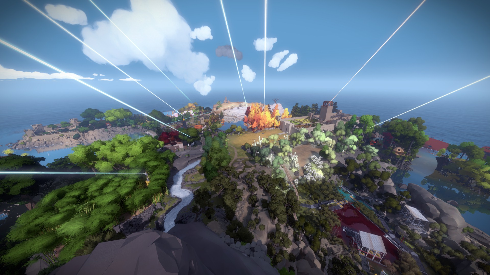
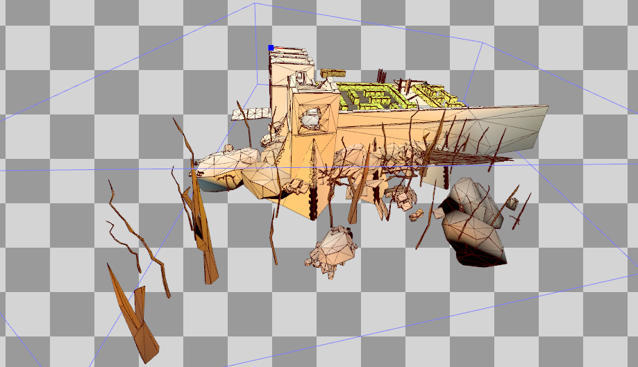
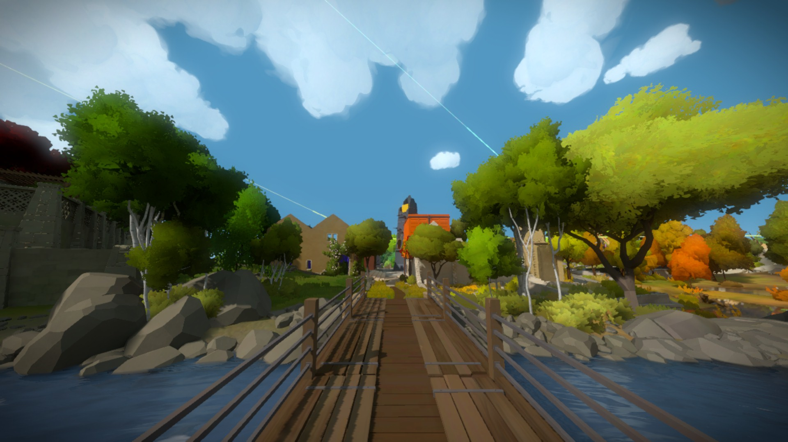
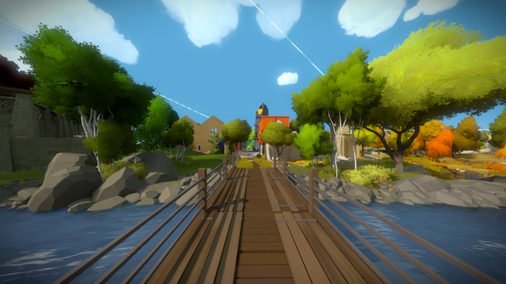

This is a follow up to the first article available [here](http://blog.thomaspoulet.fr/the-witness-frame-part-1/).

In the previous part, we discussed the chronology of a frame, and how a bunch of coordinates translates into a vibrant world, full of mysteries. In this part, I will go over several other aspects that could not be seen in the first frame.

## Texture Blending

In a time where games can easily reach the tens of gigabytes (and sometimes even the [hundreds](https://www.gamespot.com/articles/call-of-duty-infinite-warfares-130-gb-size-is-high/1100-6444309/)), The Witness and its mere four gigabytes is a lightweight in this competition.

The biggest offenders in the binary size are usually the art assets, and most specifically the textures. Using high resolution textures may enhance the photorealistic feeling of the game, but it also has a high cost in the binary, and during the production. If tools and solutions do exists to automate and generate high-res textures, going realistic will usually imply having a bigger team, especially in open environment games ( The Witness: 3 artists; [GTA V: 1k+ *but not only artists*](http://www.gamechup.com/gta-5-dev-team-size-more-than-1000-manpower-dependent-on-game-detail/) ).

The team behind the Witness, to achieve stunning visuals with their given resources, decided to use fewer and smaller textures, and combine everything mathematically. This technique is called texture blending.

{: .large-content}

{: .large-content}

Let’s focus our analysis on the castle gates and walls in the scene above.

To compose the final texture of this wall, three textures were used for the colour alone. That helps break the feeling of pattern that repeated textures can often produce. Note that this effect is still visible one the right wall, a quick check at the vertex attributes below can confirm our feeling.


Vertex attributes are put to good use to identify which part of the mesh will receive which texture. In that case, the red channel is used for the first texture, the green for the second, and the blue for the third.

{: .large-content}

{: .large-content}

I will not go in the detail of the shader here, as it is a quite long shader (~800 lines), and the lines relative to the blending are a bit confusing as they are mixed with tinting.

But most of the blending effect can be quite easily replicated with just few lines. This example is using the actual binding used in the game.

```c
    float4 texSample = texture2.Sample(sampler2, IN.param2.xy) * IN.param7.x;
    float4 texSample1 = texture3.Sample(sampler2, IN.param2.xy) * IN.param7.y;
    float4 texSample2 = texture4.Sample(sampler2, IN.param2.xy) * IN.param7.z;
    OUT.param0 = saturate(texSample + texSample1 + texSample2) * 3;
```

As we can see, this is a great way to save space and resources (these textures are 1kx1k), while still having the surfaces looking nice and detailed. Texture blending in The Witness, [according to the development team]((http://the-witness.net/news/2010/11/experiments-in-texturing/)), is also used to highlight elements in the environment. This is also a good way to do some cool effects as shown in the [Uncharted 2 presentation](http://www.gdcvault.com/play/1012449/Uncharted-2-Art).



>The dirt texture and the cobblestone textures are merged in a credible way based on the gradient texture, and the respective "volume" of each texture

## Indoor shadows

In the previous part of this series, we discussed the use of cascaded shadow maps (CSM) for high quality outdoor shadows. Now, what about indoor ones?

Just after the CSM pass, another depth only pass is dedicated to rendering the indoor shadows. This step in the rendering pipeline is automatically triggered once the player is in a certain area. Once triggered, the three closest light sources’ shadow maps are rendered onto a 3:1 ratio texture, each square being 1024x1024 pixels. For obvious optimization reasons, only the light casting the player shadow is rendered every frame. The square selection is done by rendering a mask on the texture at the right location and then rendering everything else in the square with the depth test rule *less or equal*.

{: .large-content}

{: .large-content}

As in a pure shadow map fashion, the maps are rendered from the point of view of the light and then used re-projected onto the surface they are casting shadows on.

The player is, as during the CSM pass, rendered. It is interesting to note the relative high poly model used here (~8k poly), especially when it is never directly visible during the game.

{: .small-content}

{: .small-content}

Comparatively to the number of indoor spaces, this effect is not used often. Most of the time, when shadows are not required by a puzzle or an object is not in the way of the light, the developers just used shadows baked into the regular lightmap.

## Level of Detail

The Witness is an open world game. This sentence really starts to get all its meaning when the player climbs for the first time the mountain and get to see the full island. No ugly fog or graphics trickery here, just the island, and the ocean as far as the eye can see.

{: .large-content}

{: .large-content}

To make sure this was possible the developers used a rather aggressive LOD (Level of Detail) approach. First, many meshes were merged together to save draw calls. For example, the castle in the top right corner is drawn in around ten draw calls. Meshes are not merged by theme and location, like all the castle assets together, or all the vegetation, but by what appears to be by location only.



Thanks to its relatively simple art style, the details and colours of the low LOD meshes are not done using textures, but only using the colours stored in the vertex attributes of the mesh. That is some substantial savings as the fragment shader is, as such, greatly reduced.

{: .large-content}
```nasm
    dcl_input_ps linearCentroid v0.xyz
    dcl_output o0.xyzw

        0: mov o0.xyz, v0.xyzx
        1: mov o0.w, l(1.000000)
        2: ret
```
{: .large-content}

Looking at the data at hand, I can safely guess that there are between two and three levels of details per meshes, presenting the following characteristics:

 * **Level 0**: Maximum mesh details, rendered with textures
 * **Level 1**: Low mesh details, rendered with textures
 * **Level 2**: Low mesh details, rendered with colours only

It seems that due to their location, and visibility some meshes only present a level 0 and 1.

## Graphics Settings

The Witness offer three different levels of graphical quality. Those are chosen at start up and cannot be changed at runtime.

{: .large-content}

{: .large-content}

### Low

{: .large-content}

{: .large-content}

Before analysing what is gone and what is left, one must give credits to the team for keeping so much of the visual fidelity while greatly improving the performances on lower end platforms.

First, the number of render passes dropped from 24 to around 16. This is done by merging some of them, and removing others.  
The resolution is reduced on all buffers, the main frame is rendered in 1280x720, to be up sampled at the end to the final resolution. Gone also is the nice anti-aliasing, 4xMSAA is no longer active and the FXAA pass is no longer present. The CSM pass is this time rendered on square of 256x256 leading to visible aliasing on the shadows’ edges.

A full pass is still dedicated to reflection (in a much lower resolution though) but the separate passes for water, and cloud and vfx, are now all merged inside the main scene render one.  
The bloom passes, horizontal and vertical blurs are still applied before the HDR resolution, but again at a much lower resolution.

### Medium

{: .large-content}

{: .large-content}

The medium level is just here for reference, as sadly no trickery is applied here. It is just the high setting with lower resolution and lower MSAA values (2x instead of 4x).

## Conclusion

Writing this series have been a real blast. It is not often that you can have a pick at the intricacies of a game, let alone one with a custom rendering engine. The Witness, as I said in the first part of this series, was the opportunity for me to renew with my love for he point & click genre, and enjoy again some well-crafted puzzles.

Obviously, two (rather small) articles cannot give the full picture of what is happening during the rendering of a frame. So, I would encourage you to have a look at the following sources if you want to learn more:

 * http://www.gdcvault.com/play/1020552/The-Art-of-The
 * http://the-witness.net/news/category/engine-tech/
 * http://www.artofluis.com/3d-work/the-art-of-the-witness/
 * http://www.ludicon.com/castano/blog/

This series of articles was heavily inspired by the work of Adrian Courrèges with his analysis of [GTA 5](http://www.adriancourreges.com/blog/2015/11/02/gta-v-graphics-study/), [Deux Ex](http://www.adriancourreges.com/blog/2015/03/10/deus-ex-human-revolution-graphics-study/), and others. His articles helped me while I was trying to bridge the gap between theoretical knowledge and actual rendered frames on the screen.

Finally, I would like to thank Daniele Di Donato who took the time to read and review these articles.