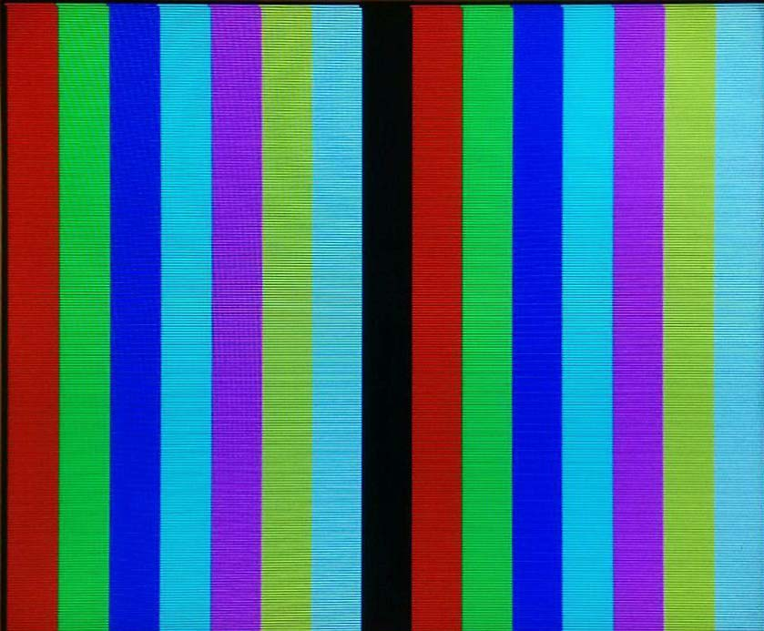

In electronics, if you want to visually interact with your user there is plenty of choices available. LEDS, LCD, dot matrix displays, OLED screens, etc … But wouldn’t be cool if our inexpensive piece of kit could play with the big boys and use the same tech. Can a microcontroller get something onto a computer monitor using the VGA standard?

“But driving a VGA screen on an 8MHz microcontroller is impossible” some may say, and for good reasons, a standard 640x480 screen requires a 25MHz pixel clock, which is just a bit more than three times the chosen microcontroller clock speed, but we will come back later to this.

So, before diving deeper, no I’m not addressing every single pixels (duh), no this is not the best way to do it (more on that later), and no I don’t think you can easily do it in C/C++.

## Hardware

One of the goal behind this project was to do it with as little components as possible, and by that, I mean the crystal, few passives, and the micro. Nothing else. As such the schematic is as simple as it can get, see it for yourself.

{: .large-content}

{: .large-content}

The microcontroller I used was a PIC16F887, clocked at 8MHz using an external crystal Q1. Ok, I will admit, this guy is overkill for the job at hand, but I mainly used it because it was in my parts bin. Any, more reasonably sized microcontroller would do the job perfectly fine.

VGA standard is using a DE-15 connector, on the 15 pins only 10 are required for this project, but still, let us break them all down.

{: .small-content}

{: .small-content}

Pin 1 | RED | Red video
Pin 2 |	GREEN | Green video
Pin 3 | BLUE | Blue video
Pin 4 | ID2/RES | formerly Monitor ID bit 2, reserved since E-DDC
Pin 5 | GND | Ground (HSync)
Pin 6 | RED_RTN | Red return
Pin 7 | GREEN_RTN | Green return
Pin 8 | BLUE_RTN | Blue return
Pin 9 | KEY/PWR | formerly key, now +5V DC, powers EDID EEPROM chip on some monitors
Pin 10 | GND | Ground (VSync, DDC)
Pin 11 | ID0/RES | formerly Monitor ID bit 0, reserved since E-DDC
Pin 12 | ID1/SDA | formerly Monitor ID bit 1, I²C data since DDC2
Pin 13 | HSync | Horizontal sync
Pin 14 | VSync | Vertical sync
Pin 15 | ID3/SCL | formerly Monitor ID bit 3, I²C clock since DDC2

In the full pinout above ([from Wikipedia](https://en.wikipedia.org/wiki/VGA_connector)), we can see that 3 pins are dedicated to the color signals, and 2 to the sync signals. To allow for high speed – 160MHz in case of [SXGA](https://en.wikipedia.org/wiki/Graphics_display_resolution#SXGA_(1280%C3%971024)) (1280x1024) – each color has its own ground, however in our case, all the grounds are tied together.

Other pins are used for more advanced operations including automatic screen information retrieval, but don’t worry, you don’t need to deal with any of this to get something on the screen.

Everything, except the color signals, are using TTL levels, meaning they can be driven directly from the microcontroller. The color signals on the other hand are a bit more complicated. Unlike other standards such as DVI the color data is not digital but analogue, meaning that the information is conveyed by a variation in voltage.

The VGA color pins are as such defined as expecting 0.7V peak to peak, 0.7V being full intensity and 0V completely off. In practice, that means driving it from the microcontroller is not possible, we must first lower the output voltage. Ohm’s law to the rescue.

The screen end of the cable is terminated with a 75 Ohm impedance and is expecting a 0.7V maximum.

$$\frac{0.7}{75}=9.3\ast{10}^{-3}$$

At full intensity, this is drawing 9.3 mA, now we can get the appropriate resistor.

$$\frac{5-0.7}{9.3\ast{10}^{-3}}=460$$

A minimum 460 Ohm resistor is needed not to fry the screen, I settled on a 510 Ohm, the closest value I had at hand.

Now by toggling on and off our microcontroller pin, we can generate 0V or ~0.7V on the pin, effectively getting the color pixel at no or full intensity. Oh glorious 8 colors capabilities, black, red, green, blue, cyan, magenta, yellow, and white!

For simplicity, I am not using any DAC (Digital Analog Converter) here, but the simplest one can be done using a resistor ladder. You would set multiple output pins per color, and set each one of them a different resistor value. You would then be able to vary the voltage in the range.


Since we are dealing with low speed signals we can work with low tech connectors. I bodged mine using an old cable cut in half. I extracted the signal wires, soldered them on a proto board, and added a pin header to plug it in a breadboard. Signal integrity is not an issue here, since screens have good error corrections capabilities.


## Software

In the introduction, I said that driving the screen in that configuration, in my opinion, could not easily be done using a high-level language such as C. This all boils down to the number of cycles we have at hand to do our processing, and to the fact that we need to be cycle accurate. As such, the code presented here is in Microchip assembly.

Before looking at some code, let’s have a more in depth look at the VGA standard. Designed while screens were still using particle beams, the VGA standard is based around sync signals. At the beginning of each frame, we must wait for the particle beam to get back to the top of the screen (vertical sync signal) and at the start of every line we must wait for him to go back to the start of the next line (horizontal sync). Obviously, screens nowadays are no longer using particle beams, but that sync time is part of the standard.


The following numbers will be given for a 640x480 resolution, complete and detailed information about other resolution of the VGA standard can be found [here](http://martin.hinner.info/vga/timing.html).

At the beginning of our frame there is the vertical sync, shown in blue in the illustration above, it accounts for a total of 2 lines. The other synchronization pulse, the horizontal one, in green above, is accounting for 96 pixels. Note that the horizontal pulse **must continue** even during the vertical sync pulse, front, and back porch.

The other structuring elements are the back and front porch. They can be found for both direction, the back porch is generated before the video data and the front after. In yellow above are both the vertical back porch and the vertical front porch, the first is 33 lines wide and the second 10. Finally, in orange are the horizontal back porch for 48 pixels and horizontal front porch for 16.

With that in mind, we can start putting some code, the microcontroller I used, as described in the hardware section, is the [Microchip PIC16F887](http://ww1.microchip.com/downloads/en/DeviceDoc/41291F.pdf). This chip got a massive amount of I/O (inputs/outputs), but I will be using 5 outputs from the A port.

### Clock cycles

The microcontroller is using an external 8MHz crystal, that means that a new clock tick is occurring every 0.125µs. According to the datasheet, an instruction cycle takes 4 clock ticks, thus an instruction takes 0.5µs to execute. Putting these numbers in perspective with the VGA standards and one can start to see the problem.


A | Horizontal sync pulse | 3.77µs | 8 cycles
B | Back porch | 1.89µs | 4 cycles
C | Color signal | 25.17µs | 50 cycles
D | Front porch | 0.94µs | 2 cycles

On the data part, we can see that we only have 50 cycles to do our things, which means that in the best of case we can only have 50 pixels on the screen, each of our pixels being 12 pixels wide. Not optimal, but it gets worse. For every cycle lost in computation, our pixels gain another 12 pixels, thus reducing the resolution even more.

### Read Modify Write and Intermediate Register

Microchip microcontrollers’ offer the ability to write the current pin status, modify it, and then write it again. This effectively allows to do ```bsf``` and ```bcf``` operation directly on the pins (bit set and bit clear). I was expecting to make good use of this feature is it would have allowed me to dynamically change the state of one color on a per pixel basis in a single operation.

```
bsf PORTA, 1	; Set the red channel to full intensity
bcf PORTA, 1	; Set the red channel to 0, 0.5µs later
```

However, first results were disappointing …

{: .large-content}

{: .large-content}

As we can see, every time we set a new value all the pins go low (*HSYNC* and *VSYNC*, respectively 3 and 4 are supposed to stay high). That is rather annoying. As it turns out, poking around the web I found that the read modify write function needs to wait for the pin to settle before cycling again, otherwise everything goes wrong. One way to solve this problem is to use shadow registers. The principle is simple, instead of directly modifying the output port register, we modify a register in RAM.

```
bsf sRegister, 1  ; Set the red to full
movfw sRegister   ; Move the shadow register to the working register
movwf PORTA       ; Set the output A to the value of the working register
```

The problem: for each pixel we lose 2 cycles writing to the temporary register and to the port.


I guess I was a bit skeptical about that whole settling time, we are talking 0.5µs between each instruction which leaves plenty of time for anything to settle. Looking at the datasheet confirmed my doubts, the output rise, or fall time were both at least an order of magnitude faster than the clock cycle. Something fishy was going on there.

The ADC was our culprit, especially the ```ANSEL``` register. The ```ANSEL``` register is used to set whether the pins are used in analog or digital, by default it is configured for analog use, and the datasheet got something very interesting to say about analog pins (emphasis are mine):

>Setting the appropriate ANSEL bit high will **cause all digital reads on the pin to be read as ‘0’** and allow analog functions on the pin to operate correctly.

Well, setting the ```ANSEL``` register solved my problem, and I could finally use bit operations directly on the output registers.

```
banksel ANSEL  ;  Switch bank tot he one containing the ANSEL register
clrf ANSEL     ; Clear the ANSEL register
```

{: .large-content}

{: .large-content}
{: .large-content}

{: .large-content}

### Setting the pixel data

Sadly, our little microcontroller does not have [DMA (Direct Memory Access)](http://ww1.microchip.com/downloads/en/DeviceDoc/60001117H.pdf) capabilities, so we will need to find another way to efficiently and in a timely manner set the output pins.

My first try was using hardcoded image build only in instructions. It was simple and blazingly fast, effectively allowing me to use the full 50 pixels with one color.

```
bsf PORTA, 1
nop		      ; Skip a cycle
bcf PORTA, 1
bsf PORTA,1
nop
nop
bcf PORTA,1
nop
```

This would result in something of the like: □■■□■■■□

This method is neither efficient nor practical. First if we want to have a mix of colors (cyan, magenta, yellow, or white) they need to be set one after another. Meaning to get white you will see: red – yellow – white, you are wasting 2 pixels to get your value. You would also need to “write” your image in code, that means 24000 lines (50*480) of bcf and bsf, who would want to do that? But guess what: it does not fit in the microcontroller memory, not speaking about the fact that you would need to switch program banks loosing even more precious cycles.

Next try was expanding on the previous one with a more “conditional” approach. The image is stored in memory and then read line by the conditional block updating the screen.

```
btfsc pixel, 1     ; If the new pixel value is clear jump
bsf sRegister, 1   ; Set red to full
btfss pixel, 1     ; If the new pixel value is set jump
bcf sRegister, 1   ; Set red to none
movfw sRegister
movwf PORTA
```


That method resulted in 6 cycles per pixel for one color, or 8 big pixels on the screen. If I wanted to add the other two colors that would mean another 8 cycles, 14 cycles in total. All in all, that would mean that I can only get 3 and a half big chunky pixels on the screen.

The method is better but loosing that many pixels is not good enough, plus it is really inefficient. It was a step towards the end goal nonetheless.

The final method was no longer based on the bit oriented operations, setting them one by one was no longer practical when dealing with colors, I went for a more direct approach, the whole output line is stored in memory and then copied to the output buffer.

{: .large-content}
```
movlw 0x24
movwf FSR     ; Set our memory pointer to the start of our image
movf INDF, 0  ; Copy the content of our pointed address to the working register
movwf PORTA   ; Copy the working register to the output
incf FSR      ; Increment the pointer
movf INDF, 0
movwf PORTA
incf FSR      ; Well you get the point
```
{: .large-content}

The whole output line being stored, this solves the problem of the two sync pulses that needs to be kept to high, as they are stored as high in memory.



Looking at the pros: this design allows me to have a whopping 16 different pixels (only 40 pixels wide!). It is reasonably easy to write and does not require to hardcode the image in the code. The maximum image size is 16x16, limited by the size of the internal EEPROM available. This is no big deal since external memory chips can be found real cheap nowadays. But this design also has some flaws. Most of the memory is wasted, in a full 8-bit word only 3 bits would be dedicated to storing the color information, out of the 5 remaining bits, 2 are used for the sync pulses, and 3 are just blank.

Having met my goal of getting something on the screen, I did not spend more time optimizing it, the biggest problem was that for every cycle spent doing some fancy logic to unpack the values, I was losing pixels.

In the previous image, you can see that every other pixel is off. Even though I am reducing the computational load by loading the image in memory, I still need to move the pointer and retrieve it from there. I decided to not render every other line in order to have 50 cycles to do some more computation, the impact on the final image being limited, it was an acceptable tradeoff.

## Conclusion

Getting things on the screen with only the help of an 8bit, 8Mhz microcontroller is possible, now as for being useful, well except in the case of a big chunky pixel effect, it is rather limited.

Obviously, generating the VGA signal only with the microcontroller is not a smart move, just by adding few more components we can make it way more useful.

First thing to change to make this design a bit more practical is another crystal. Not a new component so to say, but boosting the clock frequency would help getting more horizontal pixels on the screen, as a side effect it might give a bit more leeway in the number of cycles per pixel.

Next is adding a buffer. By adding a buffer, the rendering of images can be greatly improved, the micro would only have to send the address of the next pixel to queue, thus reducing the number of cycles lost to this task. Adding even more memory would allow a double buffering system where the micro can queue another line while it is rendering the current one.

Finally, by adding an external memory bigger images and more images can be stored, effectively making a slideshow or simple animation possible.

Anyway, that was a fun little project, useless as it stands, but interesting nonetheless. Although it helped me demystifying the VGA standard it is nowhere close to a reasonable implementation, I see it more as a proof of concept than a working prototype.
