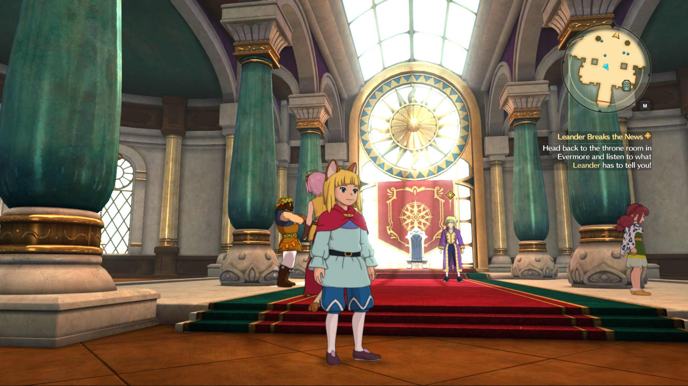

Ni No Kuni 2, released at the beginning of this year, march 2018, is the second installment in a series of Japanese Role Playing Game, developed by Level-5.  
Seven years after the Japanese release of the first game, the player is once again dropped in a magical world inhabited by anthropomorphic creatures living among humans.  

{: .small-content}

{: .small-content}

The first opus, Ni No Kuni: Wrath of the white witch, was a joint collaboration with the Ghiblli studio, this one is not. However most of team was still involved, the result is a game with the same atmosphere, feeling, and art style as the first.

This is the second article I write detailing the steps that games engine takes to render a frame, the previous one, The Witness can be found [here](https://blog.thomaspoulet.fr/the-witness-frame-part-1/). Just like in The Witness, Ni No Kuni 2 (NnK2) uses a custom engine, as opposed to using an off the shelf one of the like of Epic's Unreal Engine 4 or Unity. However unlike The Witness, no technical blog (as far as I can tell) was kept this time.  
The game was release for both PC and PS4. The version under analysis here will be the PC one running DirectX 11. This analysis does not pretend to cover all the intricacies but rather the parts I found the most interesting.  

**Spoiler Alert: Although I tried to keep the level of spoiler to an absolute minimum I might still involuntarily give some clues about  elements of the story or the gameplay, as the frame is from a point relatively advanced in the game.**  

Finally, if you haven't played it yet, I do encourage you to do so. The game is available on the [Humble Bundle store](https://www.humblebundle.com/store/ni-no-kuni-2-revenant-kingdom) with steam DRM, and [Steam](https://store.steampowered.com/app/589360/Ni_no_Kuni_II_Revenant_Kingdom/).  
So now without further ado, let's jump right into it.

## Frame Timeline

The analysis will focus on one frame in an interior setting, where I think the engine shines the most. We can find all of the elements characteristics of the NnK franchise, flat shading with line art and semi-realistic rendering. Below is the frame we will mostly be looking at.

{: .large-content}

{: .large-content}

### Shadow

The first step is the rendering of the shadows. Ni no Kuni 2 uses two different shadow maps, at different distance from the player. Both of them are rendered onto a 4k 32 bit depth texture.


This method of handling shadows fall into the category of Cascaded Shadow Maps (CSM). The goal being to increase the shadow quality while keeping a low memory footprint. The most resolution in the shadow map is concentrated around the player, reducing the visible artifacts, and the further it gets from the player the bigger the area will be covered by one texture.  

Note that for the indoor scenes three render passes are dedicated to rendering the shadows. The closest shadow map is first rendered without the player, and then, in another render pass, the characters are added.

### Depth PrePass

Ni No Kuni 2 does not use a deferred rendering pipeline. I also excluded a strict forward pipeline or its Forward+ variant  as I could find any light list computation. The closest to what is happening here seems to be a technique detailed by Wolfgang Engel in 2009 the [Light Pre-Pass](https://www.slideshare.net/cagetu/light-prepass), a technique wich was also observed by Andrian Courèges in his [Deus Ex analysis](http://www.adriancourreges.com/blog/2015/03/10/deus-ex-human-revolution-graphics-study/).  

Following the pipeline detailed in the paper for the Light Pre-Pass algorithm, the renderer starts working on the depth map along side  the normal map for the scene. All the transparent objects are excluded from this pass.  


The depth map used is a screen sized D24S8 frame buffer, but as far as I can tell the stencil part is never used. In comparison to other vast open world games that chose to use logarithmic reversed depth, NnK2 used a normal depth map, where most of the info is packed in the last 25% of the 0-1 range, due to a near plane being at 0.1 and a far plane at 1000.  

To be honest this doesn't seems to be an issue here as I have never experienced Z-fighting near the far plane while playing. For a quick visualization why floating point numbers precision quickly degrades the further it gets from 0, you can refer to the visualization below.

<blockquote class="twitter-tweet" data-lang="en-gb"><p lang="en" dir="ltr">Visualizing floating point precision loss, or &quot;why <a href="https://twitter.com/hashtag/gamedev?src=hash&amp;ref_src=twsrc%5Etfw">#gamedev</a> stuff behaves badly far from the origin&quot;<br><br>The blue dot is end of the desired vector. The black dot snaps to the closest representable point (in a simplified floating point grid with only 4 mantissa bits) <a href="https://t.co/o1HKYByIbS">pic.twitter.com/o1HKYByIbS</a></p>&mdash; 🏳️‍🌈Douglas🏳️‍🌈 (@D_M_Gregory) <a href="https://twitter.com/D_M_Gregory/status/1044008750162604032?ref_src=twsrc%5Etfw">23 September 2018</a></blockquote>
<script async src="https://platform.twitter.com/widgets.js" charset="utf-8"></script>

As said previously, the normal map is rendered at the same time as the depth map. Normal maps are used to enhance the level of detail on certain objects, like the tapestry in the background, but most of the details are still obtain with geometry, waves in the pillars.


### Light Map

Once we have the depth map and the normal map, the next step is to compute the light map. For each light source in the scene, the irradiance at the pixel is computed.  

The inputs for this operation are the two maps computed before, the depth and the normal, and a list of all the lights' information. This data structure contains the information needed to process a light in the environment, its position, attenuation factor, color, and alpha value. From what I can tell from the shader, and the result, there is nothing fancy going on here, no global illumination, no shadows, just a simple light equation. This can be felt in the final image, as most of the light is from an ambient, and the shadows are generated by the windows, and very few non dynamic sources.  


Interesting to note that this operation is done In a compute pipeline, and the output data stored in a buffer the size of screen. My guess, as to why a compute operation and not a normal full graphics pass would, be that they had an opportunity to parallelize a bit here. Sandwiched between the pre-depth pass and the color pass, this pass goes at the same time as the light scattering pass, a less intensive operation. This is no more than a guess, as I was not able to get reliable performance counter from the game.

### Light Scattering

Before adding the color to the depth, there a last step I want to look at. Only happening for indoor environment, this pass is rendering the light scattering effect, also called Light Rays or God Rays.  

<div id="slider" class="beer-slider" data-beer-label="Green">
  
  <div class="beer-reveal" data-beer-label="Red">
    
  </div>
</div>

After several step of downscaling of existing textures that will be used for this effect, the renderer start the processing. The processing is done a eight time smaller texture, 240x135, than the screen resolution.  
The red channel of the resulting texture is the output of the light scattering calculation, the green channel is a copy of the depth. Note the lower quantization, this texture being a R11G11B10 whereas the original depth is stored with 32 bits precision.  

After being rendered at very low resolution, the light scattering map goes through an up sampling step, using the full resolution depth map as indicators on how to proceed.


### Color pass

Time to add some colors to the scene. After rendering the shadows, the depth, the normals, the light map, and all the other bits and pieces that it needs, the renderer start to add color to the scene.  
Rendering the depth beforehand means that a no overdraw policy can be guaranteed throughout the rendering process. This offer the benefit of not having to worry about depth sorting CPU side, and that heavy shaders will not be run for nothing. The depth comparison flag is now *Less Equal* to properly read from the depth map. Depth write is still active, but is not needed.  

The color pass renders in screen resolution, and to 4 different render targets. Let us break them down one by one.  


The first render target is the main color image it uses 16 bit depth for every channel. Multisampling anti-aliasing is not activated, as we will see later on in the article, the anti-aliasing is left to the post-process stage.  

Nothing really special happening for this texture, the color textures fed as input for the models are sampled, and  so are the reflection map that were backed offline for the reflections. The background and all static objects are rendered first using the same shader, and then the characters are added. At this point only the basic shading on the character is done, there is not yet any line art.  


The second render target is the velocity map, the expression of the relative movement between the current and the previous frame. For now we will skim over that one, as we will come back to it later when the renderer will be using it.  


The third render targets contains a mix and match of various information, and just like the fourth, it is only written to by the characters' shader. The red channel contains what looks like material information, it is a straight pass through from the vertex data. Note on the model below the pattern at the knee, also visible in the screenshot above. The blue channel is also a pass through of some vertex data, it gives information about additional shading like folding in a piece of cloth.  

{: .small-content}

{: .small-content}

The alpha channel is also used to store the dot product of the vertex to the camera.  


The fourth and final render target is again a mix and match of different information that will be used later, let's break it down one by one.  
The green channel will be used during the line art to artistically control the color, and weight of the contour.  
The blue channel is used as an identifier, the characters have the value 0.27451. This identifier will be used during the ambient occlusion pass to discard all the pixels belonging to the characters.  
Finally, the alpha channel is a measure of the relative depth of the characters. It will be used during the contour rendering to soften the line art the further it is away from the camera.

### Line art effect

The line effect is rendered in three drawcalls, just after the main color render pass. The first pass generates a texture using the results of the multiple render targets defined before. The red channel is a copy of the third render target alpha channel, the dot product of the vertex to the camera. The green is a copy of the fourth render target green or the blend factor of the line art. The alpha channel is a copy of the alpha channel of the fourth render target, the distance of the character to the camera. This packing is done to reduce the number of texture to access during the rendering.  

{: .large-content}
<div id="slider1" class="beer-slider" data-beer-label="Blue">
  
  <div class="beer-reveal" data-beer-label="Output">
    
  </div>
</div>
{: .large-content}

The blue channel is the only *new* information to be added to this texture. The first version of the contour is computed there. It is a combination of edge detection from the material map (third render target, red channel), and the shading information that was found in the third render target blue channel, both of the channels that came from the vertex inputs.

During the next pass, the line art is multisampled 8 times to obtain a smooth line. Once sampled, the final color is obtain using a look up table that was passed as a texture. I have not seen this texture change in the snapshots I have taken, but it is possible to imagine that it can be changed at runtime to vary the line art effect.
To attenuate the very harsh contours in some areas, like where the hair splits, the green channel of the fourth render target, is used as a blending factor.  


Finally, the line layer is added to the main color, at the same time, it is also added to the depth map. However, the line art from the previous step is still really rough, and need to be filtered to avoid aliasing. The algorithm of choice here is FXAA. I will not go too much in the details, you can find the original paper [here](http://developer.download.nvidia.com/assets/gamedev/files/sdk/11/FXAA_WhitePaper.pdf).
The setup used here is really standard and is pretty much as described [there](https://www.geeks3d.com/20110405/fxaa-fast-approximate-anti-aliasing-demo-glsl-opengl-test-radeon-geforce/3/). It uses the same 1/128 for `FXAA_REDUCE_MIN` and 1/8 for the `FXAA_REDUCE_MUM`, this one is passed as a variable, we can imagine they tried to fine tune it for their performance requirements.  

{: .large-content}
```c
float dirReduce = max((lumaNW + lumaNE + lumaSW + lumaSE) * (0.25 * FXAA_REDUCE_MUL), FXAA_REDUCE_MIN);
```
{: .large-content}

{: .large-content}
```nasm
24: mul r0.x, r0.x, u_fxaaReduceMul.x
25: mul r0.x, r0.x, l(0.250000)
26: max r0.x, r0.x, l(0.007813)
```
{: .large-content}

I am still unsure why they decided to use FXAA here, when the line art texture had already been multisampled before, and as we will see, another fullscreen antialisaing pass will be applied later on.  

{: .large-content}
<div id="slider2" class="beer-slider" data-beer-label="After">
  
  <div class="beer-reveal" data-beer-label="Before">
    
  </div>
</div>
{: .large-content}

Looking at the process used to generate the line art, it is interesting to see that most of it is artist driven. The information used to generate the contours, the blending, every step of the pipeline is defined by information either encoded in the mesh vertex info or textures, giving a full control over every aspect of it. It is a choice most likely explained by the fact that the shading of the characters is one of the distinctive feature of the game.  

### Ambient Occlusion

Once done with the color rendering, the renderer start computing the ambient occlusion. The technique used is screen spaced, and is using the mask texture generated earlier during the color pass to remove characters' pixels from consideration.  


The simple shadow at the feet of the characters are then added on top, and the output is blurred ready to be blended.  


{: .large-content}
<div id="slider3" class="beer-slider" data-beer-label="After">
  
  <div class="beer-reveal" data-beer-label="Before">
    
  </div>
</div>
{: .large-content}

### Anti-Aliasing

Ni no Kuni 2 is not using any kind of built-in multisampling anti-aliasing, instead, everything is done in post using SMAA. SMAA is a direct improvement of the already popular MLAA. I will not go in-depth about this methods, you can find both of them online, at these addresses: [SMAA](https://iryoku.com/smaa/) and [MLAA](https://iryoku.com/mlaa/).  

In short, the principle is to detect both horizontal and vertical edges in the image. In our case this is done using a simple Prewitt kernel. The red channel encode horizontal edges and the green vertical edges.  


Next is to compute the blending weight using the provided pattern map. The original MLAA paper recommend using 16 pattern to cover all cases, we can see 112 of them here on the left. However they all seem to be a variation in weight of the original 16. On the right are the diagonal patterns introduced by the SMAA algorithm, once again, 16 were recommended and 80 are defined here.  

{: .small-content}

{: .small-content}


With the weight map ready the final step of the SMAA algorithm is completed and the filtered image is ready.  

{: .large-content}

{: .large-content}

The final filtering also receives the previous frame and the motion map as input, it is most likely that they chose, during the development, to go with the extend version described at the end of the SMAA presentation. Parts of the equation show there can also be found in the filtering shader.  

### Motion Blur

The next step we will consider is the motion blur effect. We will use a version of the throne room where I shake the camera from left to right, note that this effect also applies to movement of the characters not only the camera.  

During our main color pass the motion map is rendered. It is still unclear to me how this map is generated, but from what I can see, and the lack of inputs from the previous frame, the motion map is generated by combining the depth information, camera movement, bone movement. The result does seem to be static and not based on any temporal analysis.  


The red channel contains the lateral motion information, and the green the vertical, this is confirmed by the shader later on only sampling these two to find the blur direction.  

Before blurring our main image, the motion map is downscaled several time to obtain a two channel 120x68 version of it. This map is then used during the rendering to first discard any pixel where the motion blur should not be applied because they are static (or under the threshold), the main character will receive that treatment. Then it will guide, with the higher resolution map, where the blurred pixel will be sampled from. The number of sampled pixel for each final pixel is defined by a constant buffer set to 15 in that case.  

The final result is as follows. Note the patchy effect on certain edges (bottom left column) due to the low sampling, higher sampling would have probably fixed it.  


### DOF

Next step in our pipeline is the Depth Of Field effect. We will focus on the implementation here, for more details on what and where this effect comes from you can refer to [this article](https://en.wikipedia.org/wiki/Depth_of_field). In short, the further away the subject is from the focus plane, the blurrier it will be. This is a technique commonly used in games to give a more cinematic/realistic look to the environment.  
The scene we are looking at is too small to allow for this effect to be noticeable, as such we will look at an outdoor scene, below is the scene before the effect is applied.  


First a bidirectional Gaussian blur is applied to the whole image in two passes at half resolution. Then this blurred version of the image is blended into the main render using the depth information.  


However this effect is not perfect, and in some cases artifacts are visible where there is high disparity of depth between two nearby pixels. The image below showcase such issue near the gold top of the tower. The sharp edges of the tower are shadowed by their very blurry version in the background.  

{: .small-content}

{: .small-content}

### Bloom

An important part of the visual identity of the game comes from its heavy use of the bloom effect, which alongside the scattering effect shown earlier gives a real sense of majesty to this scene.  
To achieve the desired result, Ni no Kuni 2 uses three different downscaled blurred versions of the main render color image.  

First off, the brighter area are extracted from the color image.  

<div id="slider4" class="beer-slider" data-beer-label="Output">
  
  <div class="beer-reveal" data-beer-label="Input">
    
  </div>
</div>

This is done by darkening the main color image and a half resolution version of it. To avoid artifacts from the high contrast area on the down scaled version a crude edge detection is done and the area contrast lowered.

<div id="slider5" class="beer-slider" data-beer-label="Edges">
  
  <div class="beer-reveal" data-beer-label="Input">
    
  </div>
</div>

{: .large-content}
```c
// Sampling our textures
float4 tex = _ColorTex.Sample(_ColorTexSampler, IN.param1.xy);
float4 subLum = _SublumTex.Sample(_SublumTexSampler, IN.param1.xy);

// Edge detection
float4 sub = subLum - tex;

// Gathering the edges in all channels
float m = max(max(sub.x, sub.y), sub.z);

// Reducing the contrast
float3 t = -m.xxx * float3(1.5, 1.5, 1.5) + subLum.xyz;
```
{: .large-content}

However, from what I can see, in this scene, only the original darken image is used, the darkened version of the half resolution is rarely.  
Next a bidirectional Gaussian blur is applied in two passes.  


In comparison to some other games, the bloom effect in NnK2 is very wide, so my guess is that the artists and engineers involved in the development of this effect felt that a single blurred map was not enough, two other down scaled version of this image were done, each time, on top of the downscaling, a bidirectional Guassian blur is also applied.  

Note that the framebuffer resolution is not reduced, and the downscaling is done in the vertex shader simply by shrinking the image in the corner.  


Finally, the bloom is applied on the original color image.  

{: .large-content}
<div id="slider6" class="beer-slider" data-beer-label="After">
  
  <div class="beer-reveal" data-beer-label="Before">
    
  </div>
</div>
{: .large-content}

### UI
Rendering the user interface is done in four different steps. The first part of the UI to be rendered are the quest markers and other in-scene elements like the name of the enemies. Special mention for the multi-alphabet texture used to render the text, fully using the 4 channels. I could identify the Greek, Cyrillic, Latin, Japanese, Chinese alphabets, and some other random ascii symbols.  

{: .large-content}
<div id="slider7" class="beer-slider" data-beer-label="After">
  
  <div class="beer-reveal" data-beer-label="Before">
    
  </div>
</div>
{: .large-content}

Next step is to render the on-screen static UI elements, such as the quest information on the right, and the background for the minimap.

{: .large-content}
<div id="slider8" class="beer-slider" data-beer-label="After">
  
  <div class="beer-reveal" data-beer-label="Before">
    
  </div>
</div>
{: .large-content}

Next, the dynamic elements of the minimap, characters position, quest markers, are rendered offscreen.  

{: .small-content}

{: .small-content}

For the last step, the dynamic layer of the minimap and the combat UI (expect in cities) are added to the main color image.  

{: .large-content}
<div id="slider9" class="beer-slider" data-beer-label="After">
  
  <div class="beer-reveal" data-beer-label="Before">
    
  </div>
</div>
{: .large-content}

## Conclusion

With the UI finally done, our frame is fully rendered, and the end for this article is here.  

Let's be honest, there is still a lot to be said about the rendering of this game, I have not touched in the article the rendering of the outdoor scenes and the cities. There are a lot of little trick here and there, but my main interest going into this analysis was how this very distinctive style was achieved.
