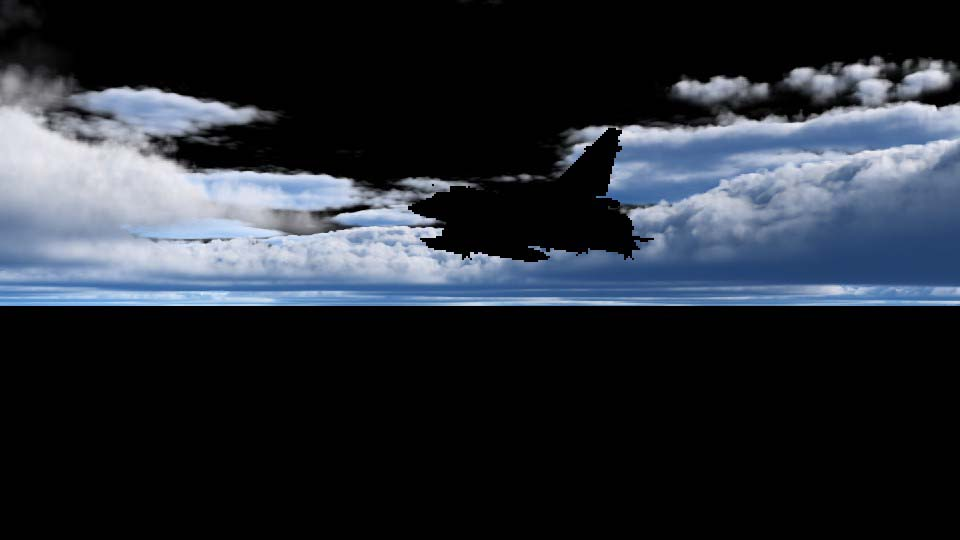
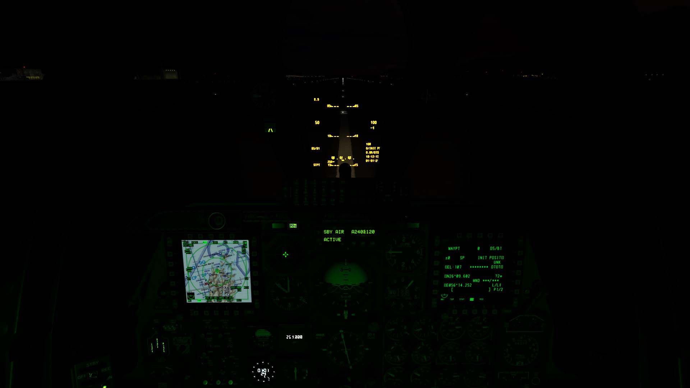

Digital Combat Simulator (DCS) is a flight simulator released first in 2008 as a successor to the Lock-On series by Eagle Dynamics. It features a wide range of ultra-realistic planes and helicopters to choose from and engage in various combat scenarios.

{: .small-content}

{: .small-content}

The game offers a very high level of realism in the avionic systems with a design philosophy where every switch and dials are simulated.

During the summer DCS world, the base module supporting the others (plane, helicopters, terrain), received its 2.7 update and with it some big changes to the rendering engine. Running on a custom engine with different constraints from AAA console game engines, I found the opportunity to have a look at the rendering too tempting.

If you are a fan of flight simulation or enjoy spending hours learning complex systems, I would recommend checking [Eagle Dynamics’ website](https://www.digitalcombatsimulator.com/en/shop/) to learn more.

## Frame Timeline

As you can imagine with such a simulator the scenarios to cover are plenty, but for the sake of this analysis I decided to settle on two: one from the outside looking at a Dassault Mirage 2000 and another one from inside the cockpit of a Fairchild Republic A-10 Thunderbolt II at night.

{: .large-content}

{: .large-content}

> A small disclaimer before going further. This simulator can be quite resource hungry, and my PC is starting to show its age, as a result the frames showed here were captured in medium quality and may be missing some advanced rendering effects.

### Displays

The first step in pipeline is the rendering of the displays. In the case of the A-10C, these Multi-Function Displays *(MFD)* are composited mostly out of textual UI elements, but they can also display a map for the Tactical Awareness Display *(TAD)*, or a camera feed for the Targeting Pod *(TGP)* or the AGM-65 Maverick missiles.

At this point in the rendering the elements are only composited, the actual content (map, video feed) is not rendered, that will be done a little later, and at a potential lower framerate adjustable in the settings.


Every UI element comes as a two indexed drawcalls, one to create the background and one to render the glyph. As far as I could tell, these comes as two different index and vertex buffer per drawcall with every drawcall uploading a new version of the constant buffer containing the tint and positional information (and a couple of unrelated data for a total of 288 bytes). The geometry is assembled on the CPU, and rendered as a 3D geometry, most likely because the framework is shared with the other interface rendering systems.

### Cascaded shadow maps *(CSM)*

The shadow map is rendered in a 4 slices array of 4K targets of 16bit depth.

{: .large-content}

{: .large-content}

The rendering of a slice is split in two:
* The static environment
* The non-static objects (players aircraft)

There is nothing to not for the latter except that no proxy shadow caster meshes are being used for far away slices and lodding doesn’t seem to be used resulting in a pretty poor triangle to pixel ratio.


The shape above, covering around 100 pixels is a plane in the furthest shadow map. It required just above a million vertices to render, for a vertex to pixel ratio close to 10 000. Not that ideal!

The static environment meshes such as buildings and vegetations are rendered in two parts:
* **Scattering**: a set of compute jobs that scatter, select a lod, and generate some indirect drawcalls
* **Rendering**: a bunch of indirect drawcalls renders the instances

> This pattern for rendering and scattering the static environment meshes is also used during the GBuffer pass.

It’s interesting to note that the indirect drawcalls are emitted using DrawInstancedIndirect with only the first two arguments used (note that the instance count is often one).

```c
typedef struct D3D12_DRAW_ARGUMENTS {
  UINT VertexCountPerInstance;
  UINT InstanceCount;
  UINT StartVertexLocation;
  UINT StartInstanceLocation;
} D3D12_DRAW_ARGUMENTS;
```

No vertex buffer is bound to the drawcall as it is composited *on the fly* inside the vertex buffer. The mesh is generated using information from the scattering pass defining the type of buildings and a mapping to their vertex ranges in a big buffer.

As a final point on that topic, it seems that the engine does not make use of bindless as a result, lots of empty indirect drawcalls are being generated which can, to some extent, put some pressure on the GPU.

### Cockpit environment map


Next, the environment cubemap of the cockpit is rendered at 256x256 along with its mip chain. That texture will be used later during light resolve and the cockpit transparent rendering as a source for Image Based Lighting *(IBL)*.

That texture is simply composited from a prebaked cubemap of the cockpit, a cubemap of the environment, the cloud texture, the shadow maps, and the atmospheric light scattering texture.

### GBuffer pass

The GBuffer layout used here is something I don’t run into quite often. Backed by a texture array it is composed of five `R8G8_UNORM` layers, with MSAA activated.

The first layer contains the normal using a basic encoding scheme. They are storing the X and Y components and reconstructing the Z. For more details on this check Aras [excellent writeup on that topic](https://aras-p.info/texts/CompactNormalStorage.html). A quick peek at the SSAO pass will confirm the intuition.

{: .large-content}
```nasm
ld_ms(texture2dmsarray)(float,float,float,float) r1.zw, r5.xyww, GBufferMap.zwxy, l(0)
ld_ms(texture2dmsarray)(float,float,float,float) r0.w, r5.xyzw, GBufferMap.yzwx, l(0)
mad r1.zw, r1.zzzw, l(0.0000, 0.0000, 2.0000, 2.0000), l(0.0000, 0.0000, -1.0000, -1.0000)
add r5.x, r1.w, r1.z
add r5.z, -r1.w, r1.z
mul r5.xz, r5.xxzx, l(0.5000, 0.0000, 0.5000, 0.0000)
add r1.z, abs(r5.z), abs(r5.x)
add r5.y, r1.z, l(-1.0000)
dp3 r1.z, r5.xyzx, r5.xyzx
rsq r1.z, r1.z
mul r5.xyz, r1.zzzz, r5.xyzx
ge r0.w, l(0.5000), r0.w
movc r5.w, r0.w, r5.y, -r5.y
```
{: .large-content}


The albedo is stored across three channels, but since the frame is rendered in HDR that information is being encoded using YUV. The first channel of the second layer contains the Y and the first and second channel of the third layer the U and V.


In the layer four we find the roughness in the first channel and the metalness in the second channel.


Finally in the fifth layer we find the precomputed AO provided by texture in the first channel. For the second channel it seems to contain some data representing crevices, my bet would be that it is used to further reduce the light in these gaps. I am unsure of that last one as modding information on these textures is sparse, especially on that alpha channel within these *RoughMet* Textures.


Finally, we will note that the stencil is use extensively to tag materials. Here are some example values:
* 0x04: Terrain
* 0x06: Runway
* 0x08: Plane
* 0x0D: Building
* 0x25: Vegetation
* 0x28: Cockpit


The Gbuffer is rendered in three steps. During the first the cockpit is rendered, then it is the fuselage and non-static objects, and finally like during the shadow maps the terrain and environment meshes are rendered using the compute/indirect drawcalls combo.

### Reflections

For reflections a dual system is used. First an environment reflection map is generated at close to 70% of the framebuffer resolution.


Then a screen space reflection (called SSLR in the game) map is calculated at half the resolution, and then subsequently expended and blurred for 3 mip level down to 120*67.


### SSAO

SSAO is calculated in a standard way using the depth and normal out of the GBuffer and then blurring it using a 9x9 kernel.

```nasm
mov r0.w, l(-4)
loop
  ilt r2.z, l(4), r0.w
  breakc_nz r2.z
  mov r2.w, l(-4)
  loop
    ilt r3.z, l(4), r2.w
    breakc_nz r3.z
    iadd r2.w, r2.w, l(1)
  endloop
  iadd r0.w, r0.w, l(1)
endloop
```

{: .large-content}
<div id="slider1" class="beer-slider" data-beer-label="Blurred">
  
  <div class="beer-reveal" data-beer-label="Traced">
    
  </div>
</div>
{: .large-content}

### Light resolve

DCS is shaded using deferred with a clustered light twist. This has the benefit of speeding up even more the light calculation by reducing the number of lights that needs to be evaluated while computing the light equation. We can witness that in action through the light index buffer.


This texture provides an offset into the light index buffer that is used to remap into the two structured buffer that contains the omni lights and spotlights. In the current scene, 1 omni and 16 spotlights were used.


### Volumetric Clouds
Long gone is the time of billboard clouds in flight simulators, visual improvements are undeniable but most importantly in a combat flight simulator where players might engage in dog fights among the clouds perfect volumetric consistency is key. DCS understood that and is dedicating a non-negligible amount of time to render them.

The driving that system are two signed distance field textures. One to drive the horizontal patterns and one to drive the vertical disposition.


I could not find solid evidence of that, but from the looks of it I would assume that the barrel distortion could be there to reinforce the round earth effect at the horizon. I could not find traces of these maps being generated real time, but I will assume that they are calculated at a lower frame rate (and I just got unlucky in my sampling).


The vertical one is self-explanatory and represents the vertical distribution of clouds at different altitudes.

These two textures are put together to form a cloudscape signed distance field representing where clouds are in the sky.


That previous information is then used to ray-march the volumetric clouds using another set of cloud density textures for the rough shaping of the clouds and a 128-pixel 3D cube of Perlin-Worley noise for the final details. Finally the clouds are blended with the result of the light step.

{: .large-content}
<div id="slider1" class="beer-slider" data-beer-label="Final">
  
  <div class="beer-reveal" data-beer-label="Clouds">
    
  </div>
</div>
{: .large-content}

I sadly cannot cover everything related to cloud rendering in that article, especially regarding shading, but if you want to learn more on that topic, I strongly encourage you to check both presentations from the team at Guerilla Games. I feel both systems are quite similar.

* [Nubis: Authoring Real-Time Volumetric Cloudscapes with the Decima Engine](https://advances.realtimerendering.com/s2017/Nubis%20-%20Authoring%20Realtime%20Volumetric%20Cloudscapes%20with%20the%20Decima%20Engine%20-%20Final%20.pdf)
* [The Real-Time Volumetric Cloudscapes of Horizon Zero Dawn](https://d3ihk4j6ie4n1g.cloudfront.net/downloads/assets/The-Real-time-Volumetric-Cloudscapes-of-Horizon-Zero-Dawn.pdf?mtime=20200402093023&focal=none)

### Transparent and cockpit emissive

Following that, the transparent and emissive surfaces in the cockpit are added. Every element is rendered as its own piece of geometry, including the HUD elements, that are rendered as if they were UI elements but in 3D space. As a final touch the prerendered camera views are copied on their respective screen.

{: .large-content}
<div id="slider1" class="beer-slider" data-beer-label="After">
  
  <div class="beer-reveal" data-beer-label="Before">
    
  </div>
</div>
{: .large-content}

### Bloom & HDR resolve

Nothing fancy in the bloom pass, first the luminance is extracted and then the target is successively scaled and blurred in two passes (vertical/horizontal) using a 13 values kernel.

As the last step, the six layers are blended and tinted to achieve the desired artistic effect. While applying the result of the bloom pass, the HDR target is also resolved to SDR using the ACES filmic tone mapping method. You can learn more on that there:
* [https://knarkowicz.wordpress.com/2016/01/06/aces-filmic-tone-mapping-curve/](https://knarkowicz.wordpress.com/2016/01/06/aces-filmic-tone-mapping-curve/)
* [https://github.com/ampas/aces-dev](https://github.com/ampas/aces-dev)

These were great resources to get me started on the topic. Additionally, you can check this shadertoy for some comparison of the different tone mapping curves.
[https://www.shadertoy.com/view/WdjSW3](https://www.shadertoy.com/view/WdjSW3)

{: .large-content}
<div id="slider1" class="beer-slider" data-beer-label="SDR">
  
  <div class="beer-reveal" data-beer-label="HDR">
    
  </div>
</div>
{: .large-content}

### Heat effect

The heat distortion effect starts by calculating the area where it will be applied and the intensity of it. This is achieved by rendering once again the geometry that use for the engine exhaust.


That mask information is then used to distort the look up of the texture using a precomputed noise map as a guide. The MSAA is also resolved during this pass.

{: .large-content}
<div id="slider1" class="beer-slider" data-beer-label="After">
  
  <div class="beer-reveal" data-beer-label="Before">
    
  </div>
</div>
{: .large-content}

## Conclusion

With just the final 2D UI elements to render the analysis is done. I really enjoyed having a peek under the hood, and let’s face it I left plenty out of this post. DCS is quite different from the usual AAA content I am used to; constraints are different and skillfully played with to produce such a realistic result.

As a final word, I am really happy to see that more and more peoples are posting online their frame analysis, if you want to check them all Adrian keeps an index available [here](https://www.adriancourreges.com/blog/2020/12/29/graphics-studies-compilation/).
