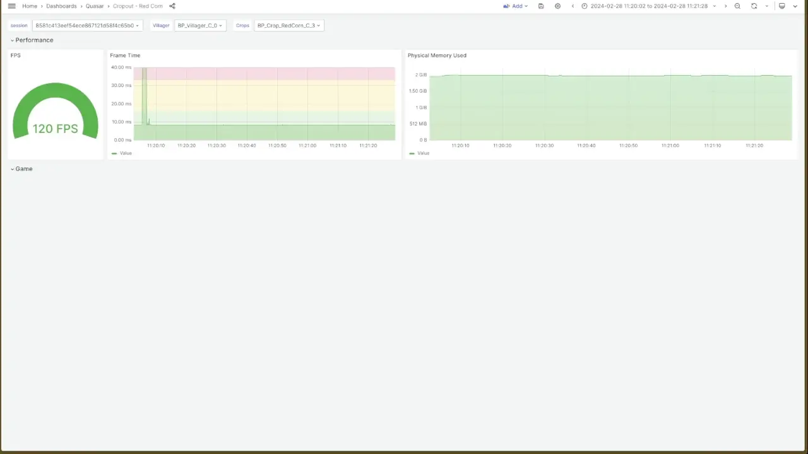

You are making a game. You have this idea for a fantastic physics-based character controller. You can already imagine your cool character zooming around the map, but for now what you see on screen is only a physics-driven mess.

I know how you feel, I've been there.

We are going to discuss some of the tools we are using to develop our upcoming physics driven title. This article is not a how-to, but a quick presentation of some of the tools included in Unreal, how to use them, and how we shifted our approach over time.
Towards the end, I'll give a preview of a tool we developed internally that dramatically improved our iteration time for debugging physics interactions.

## The problem

Physics-driven character controllers are incredibly complex systems. They rely on a wide variety of inputs to compute their final state: User inputs, environmental inputs, previous states, physics states.

Assembling and more importantly tuning them all to work together is hard, and ultimately often feels like playing a game of Jenga set on three vertical bricks balanced on top of each other all hidden behind a curtain.

Over time the core physics controller become a black box, a sacred entity one shan’t touch out of fear of summoning the great ancients.

{: .small-content}
***It shouldn't have to be that way. At least I believe so.***
{: .small-content}

Our company provides consulting services to the AAA industry, but on the side we also work on our own title. A physics-driven game.

The problems I describe here are problems we are facing every day. Every tuning session improves one thing while breaking another, every new feature requires careful iterations of the physic model.  
Our solution to not lose our sanity? **Observability**.

## Observability

I'm not pretending that we developed the best physics-based character controller ever, but I believe we've managed to make the process a lot smoother for ourselves.

Our key to that success is to provide the maximum amount of data in the most convenient form possible to our designers. You'll find no one to argue that quick data-driven iteration is what any team should be aiming for.

I found there is a direct correlation between iteration time and being able to see all of the system's internals in movement.

### On-screen logging

Let's start with the simplest, and the one most are familiar with is: the `AddOnScreenDebugMessage` function.  
Perfectly suited for logging simple events, or slowly changing values, it's the easiest to setup.

{: .large-content}
```c
#if !UE_BUILD_SHIPPING
    constexpr uint64 ModuleKey = 0x0001;
    constexpr uint64 ValueKey = 0x0001;

    GEngine->AddOnScreenDebugMessage(((ModuleKey << 32) | ValueKey), 100.0f, FColor(255, 0, 0), FString::Printf(TEXT("Velocity: [%s]"), *GetVelocity().ToString()));
#endif // !UE_BUILD_SHIPPING
```
{: .large-content}

By providing a unique key at the start, you make sure your message always replaces the previous one. Perfect to keep an eye on a rapidly changing value.

{: .quote-note}
> Note how the key is constructed. To have the message stay on screen, you need to specify a unique key. We found that defining a unique `ModuleKey` per component, and then OR it with a unique value key limits collision. A little meta management of your keys will save you a lot of time figuring out why your message isn't showing up.
{: .quote-note}

{: .small-content}

{: .small-content}

If you want to skip code or just want an even quicker implementation, this function also exists in Blueprint. Just look for **Print String**.

{: .small-content}

{: .small-content}

### Gameplay Debugger

We used on-screen logging extensively when we started, but with an increasing number of systems, the amount of clutter on screen became unbearable.  
We needed more control on how to print and where to print the values. The solution: The [Gameplay Debugger Tool (GDT)](https://dev.epicgames.com/documentation/en-us/unreal-engine/using-the-gameplay-debugger-in-unreal-engine?application_version=5.0).

By default, you have a few categories already populated by Epic. What is really outstanding is that you have 93 categories left open for your project.
Think of them as Photoshop layers: You can activate them independently with different layout and information to fit your current needs.  
One for economy, one for meta, one for your physics controller? It is all up to you!

{: .quote-warning}
> Using the Gameplay Debugger require you to have a module in the `PreDefault` loading phase. If your game module loads in `PostConfigInit` due to custom shaders for example, you will need to create another module. In general, it is not a bad idea to have a debug module anyway.
{: .quote-warning}

Setting up the GDT can be a little convoluted, and the outdated documentation certainly didn't help us it making it work.  
So here is a quick crash course to get you started.

First, add the GDT to your module. To do that, add its definition to the constructor of the module's `Build.cs` file.

```c
SetupGameplayDebuggerSupport(Target);
```

Then to setup your custom GDT category, you need to declare it in the startup function of your module. Don't forget to deregister it upon module shutdown.

{: .large-content}
```c
void FMyGameDebugModule::StartupModule()
{
    IModuleInterface::StartupModule();

#if WITH_GAMEPLAY_DEBUGGER
    IGameplayDebugger& GameplayDebuggerModule = IGameplayDebugger::Get();

    // This ID will define the position of the category in the list. If the ID is already in-use, the categories will share the layer key.
    constexpr int32 categoryId = 7;

    GameplayDebuggerModule.RegisterCategory("MyGame", IGameplayDebugger::FOnGetCategory::CreateStatic(&FGameplayDebuggerCategory_MG::MakeInstance), EGameplayDebuggerCategoryState::EnabledInGameAndSimulate, categoryId);
    GameplayDebuggerModule.NotifyCategoriesChanged();
#endif // WITH_GAMEPLAY_DEBUGGER
}

void FMyGameDebugModule::ShutdownModule()
{
#if WITH_GAMEPLAY_DEBUGGER
    if (IGameplayDebugger::IsAvailable())
    {
        IGameplayDebugger& GameplayDebuggerModule = IGameplayDebugger::Get();
        GameplayDebuggerModule.UnregisterCategory("MyGame");
        GameplayDebuggerModule.NotifyCategoriesChanged();
    }
#endif // WITH_GAMEPLAY_DEBUGGER

    IModuleInterface::ShutdownModule();
}
```
{: .large-content}

With the category declared, let's define the functions needed to print some data on the screen.

{: .large-content}
```c
#pragma once

#include "CoreMinimal.h"

#if WITH_GAMEPLAY_DEBUGGER_MENU
    #include "GameplayDebuggerCategory.h"

// All GDT category classes must inherit `FGameplayDebuggerCategory`, the naming convention across the engine is `FGameplayDebuggerCategory_{module initials}`
class FGameplayDebuggerCategory_MG : public FGameplayDebuggerCategory
{
public:
    FGameplayDebuggerCategory_MG()
    {
        SetDataPackReplication<FRepData>(&DataPack);
    }

    // This virtual function captures the data relevant for that category and replicates them inside the `DataPack`
    virtual void CollectData(APlayerController* OwnerPC, AActor* DebugActor) override
    {
        // Here, I'm using the `APawn` directly, but you can also cast into your own types. Remember to friend this class if you want to access private members
        APawn* MyPawn = OwnerPC->GetPawn();

        if (MyPawn)
        {
            DataPack.Velocity = MyPawn->GetVelocity();
        }
    }

    // This virtual function is responsible for composing this category layout
    virtual void DrawData(APlayerController* OwnerPC, FGameplayDebuggerCanvasContext& CanvasContext) override
    {
        CanvasContext.Printf(TEXT("Velocity: {yellow}%s"), *DataPack.Velocity.ToString());
    }

    static TSharedRef<FGameplayDebuggerCategory> MakeInstance()
    {
        return MakeShareable(new FGameplayDebuggerCategory_MG());
    }

protected:
    // That structure contains the data that will be replicated to be used by the category
    struct FRepData
    {
        FVector Velocity;

        // Don't forget to add the `Serialize` function and serialize all the members
        void Serialize(FArchive& Ar)
        {
            Ar << Velocity;
        }
    };
    FRepData DataPack;
};

#endif // WITH_GAMEPLAY_DEBUGGER_MENU
```
{: .large-content}

With that setup we now have a new category in the GDT. To open it, simply press the `'` key on your keyboard.


You most likely have experience adding debug visualization in your actors, but did you know that you could add them to the GDT instead, making it easier to toggle on and off?

{: .large-content}
```c
// This function creates a new custom proxy to render our custom visualizer for the data
virtual FDebugRenderSceneProxy* CreateDebugSceneProxy(const UPrimitiveComponent* InComponent, FDebugDrawDelegateHelper*& OutDelegateHelper) override
{
    OutDelegateHelper = nullptr;
    return new FMyGameDebugSceneProxy(InComponent, DataPack);
}

// This function is triggered every time a new data packet is ready. When that is the case we force the recreation of the scene proxy
virtual void OnDataPackReplicated(int32 DataPackId) override
{
    MarkRenderStateDirty();
}
```
{: .large-content}

As you may have noticed, the `CreateDebugSceneProxy` function returns an instance of a `FMyGameDebugSceneProxy`. This new class is responsible for generating the visualizers.
Let's check it now.

{: .large-content}
```c
class FMyGameDebugSceneProxy final : public FDebugRenderSceneProxy
{
public:
    SIZE_T GetTypeHash() const override
    {
        static size_t UniquePointer;
        return reinterpret_cast<size_t>(&UniquePointer);
    }

    // In the constructor we define the various visualizers, in that case an arrow from the actor on the velocity vector
    FMyGameDebugSceneProxy(
    const UPrimitiveComponent* InComponent,
        const FGameplayDebuggerCategory_MG::FRepData& RepData
    ) : FDebugRenderSceneProxy(InComponent)
    {
        ArrowLines.Add(FDebugRenderSceneProxy::FArrowLine(RepData.PawnPosition, RepData.PawnPosition + RepData.Velocity.GetSafeNormal() * 100.0, FColor::Red));
    }

    // This function is a simple boilerplate to check the visibility of the scene proxy
    virtual FPrimitiveViewRelevance GetViewRelevance(const FSceneView* View) const override
    {
        FPrimitiveViewRelevance Result;
        Result.bDrawRelevance = IsShown(View);
        Result.bDynamicRelevance = true;
        Result.bSeparateTranslucency = Result.bNormalTranslucency = IsShown(View) && GIsEditor;
        return Result;
    }
};
```
{: .large-content}

In my opinion, another truly outstanding feature of the GDT is the ability to add custom keyboard controls to your categories. I'll leave that part out for brevity, but you can find a couple of examples in the engine if you look for the `FGameplayDebuggerCategory_*` classes.

### Visual Logger

Logging things as they happen is already a great step towards observability. But sometimes, coming back to a past session in order to reexamine the data in greater detail can be as helpful, if not more.  
Maybe you want to compare with a previous version of the behaviour to see what changed, or simply, you want to take your time to examine all the forces being applied as your actor is thrown 10 feets in the air after stepping on a jump pad.

You'll be happy to learn that Unreal ships with such a tool already: the Visual Logger.

To learn how to use the tool's UI, you can check its [documentation](https://dev.epicgames.com/documentation/en-us/unreal-engine/visual-logger-in-unreal-engine?application_version=5.4).

Interacting with the Visual Logger is sadly a C++ only thing, but if you already have a project setup for it, it's rather straight forward.  
Any actor that needs to interact with the Visual Logger just need to inherit the `IVisualLoggerDebugSnapshotInterface` public interface.
That interface comes with a method we can override: `virtual void GrabDebugSnapshot(FVisualLogEntry* Snapshot) const override;`

Here is an example using the velocity arrow visualization I presented in the Gameplay Debugger section.

{: .large-content}
```c
#if ENABLE_VISUAL_LOG
virtual void GrabDebugSnapshot(FVisualLogEntry* Snapshot) const override
{
    IVisualLoggerDebugSnapshotInterface::GrabDebugSnapshot(Snapshot);
    const int32 idx = Snapshot->Status.AddZeroed();

    FVisualLogStatusCategory& category = Snapshot->Status[idc];
    Category.Category = TEXT("MyGame");
    Category.Add(TEXT("Velocity"), FString::Printf(TEXT("%s"), *GetVelocity().ToString()));
    Snapshot->AddArrow(GetActorLocation(), GetActorLocation() + GetVelocity().GetSafeNormal() * 10.0f, "Velocity", ELogVerbosity::Verbose, FColor::Red, "Velocity");
}
#endif // ENABLE_VISUAL_LOG
```
{: .large-content}

In this example, we add a new category to our Visual Logger. It contains information about the Velocity of our actor, as well as an in-viewport visualization of its velocity.


{: .quote-warning}
> The code above should automatically capture the actor's states, but unless I added one of the direct log macros, I couldn't get it to make snapshots. I just ended up adding a `UE_VLOG` macro in the `Tick` function.
{: .quote-warning}

If this way of capturing variables can be considered indirect, there is also a direct approach. Unreal exposes a couple of macros to that effect; here are a couple (check `VisualLogger.h` for the full list):

{: .large-content}
```c
#define UE_VLOG(LogOwner, CategoryName, Verbosity, Format, ...)
#define UE_VLOG_SEGMENT(LogOwner, CategoryName, Verbosity, SegmentStart, SegmentEnd, Color, Format, ...)
#define UE_VLOG_ARROW(LogOwner, CategoryName, Verbosity, SegmentStart, SegmentEnd, Color, Format, ...)
```
{: .large-content}

If you want to visualize your variables' changes over time on a plot, the Visual Logger also offers a way to do so.

{: .large-content}
```c
UE_VLOG_HISTOGRAM(this, "MyGame", Verbose, "Velocity", "X", FVector2D(GetWorld()->GetTimeSeconds(), GetVelocity().X));
```
{: .large-content}


{: .quote-note}
> Rare did a great [presentation](https://www.youtube.com/watch?v=hWpbco3F4L4) showcasing some of the uses they got out of the Visual Logger. If you are unsure how to best use it in your project, I recommend you check it out.
{: .quote-note}

The Visual Logger is a great tool to visualize historical data over time, but ultimately we found it a bit clunky to use.  
Here are some issues, we had with it:
* Graphs are only visible in the main viewport, and multiple graphs are going to overlap making it hard to read values
* The graph's time range is limited to 0.5s making it near impossible to debug slowly changing values
* The API requires direct integration in the actor's game code

## Ariadne

In our search for better observability, we explored developing our own tools using ImGui.  


We went quite far with it, and are still using it for some interactions, but ultimately it fell short in providing a good experience to the team.  
Every variable had to be manually extracted, every visualization built from code; the engineering team involvement was too high. That involvment not only meant that the engineers were constantly context switching to fulfill these requests, but designers had to wait for the changes to be checked-in, further adding friction.

> [!NOTE]
> For our project we made use of the [Network Imgui plugin](https://github.com/sammyfreg/UnrealNetImgui) I would really encourage you to give it a try. Having ImGui over the network isn't that interesting when developing locally but is game changer when working on a target device.

{: .small-content}

{: .small-content}

When I first envisioned Ariadne, I wanted something great for both live and historical data, something the **whole** development team could use without having to fall back on to the engineering team. Ultimately, I wanted something where you could adapt the visualization to your task.

At the hearth of Ariadne is a server collecting all the data from the development team's game sessions.  
Every game played is recorded, but what I think really sets Ariadne apart is that every variable is being recorded by default. After tagging an actor, all its variables will automatically be reflected on the server.


In my opinion this is the critical element to total observability. Having the development team effort decoupled from the engineering team is what reduces iteration time.  
It's what makes it easy to track a bug that happens once every ten playthroughs. You don't have to ask yourself if you tagged the right property, whether that was the one you needed, or guess before you even understood the bug's reach.

Once a session has been recorded developers can find it on Ariadne's online dashboard. Here a handy link will lead them to the selected Grafana dashboard with the right session opened and ranged.

{: .quote-note}
> Grafana is an industry standard tool usually used for server and application monitoring. It's intuitive and already ships some outstanding visualization.
{: .quote-note}

{: .large-content}

{: .large-content}

If you have already used Grafana, you are probably wondering where the map and the vector view comes from. These are some custom panels we built to facilitate visualization and make it even more tailored to game development.

But what if you didn't have a dashboard ready for your task? Every bug is different, so why not make a dashboard tailor-made for that bug?  
Using Grafana stellar *WYSIWYG* interface, our designers can very easily add panels, visualize the right variables, and in a matter of seconds build their own dashboard.

{: .large-content}

{: .large-content}

Ariadne is so verstile, I even ended up using it for some Forza live race tracking, and post-race analysis.


*Is Ariadne complete?*

Of course not! As for any engineer's pet project, Ariadne is far from complete. We've already identified some improvements to help us catch performance regression early, or facilitate balancing work.  
It is a tool that we have built to scale with us, from our current limited pre-production needs, all the way to the final stretch to release.  

## Conclusion

I trust I've given you a good overview of the tools you can find in Unreal; how to use them and when to use them.

As a quick summary, here is a breakdown of the solutions we explored on our road to improved observability:

| Name | Pros | Cons | Available | Time |
| --------------- | --------------- | --------------- | --------------- | --------------- |
| On-screen logging | Easy and fast to setup | No custom position - Not suited for high-frequecy data | Blueprint & C++ | Live |
| Gameplay debugger | Highly customizable - Multiple layers | Not suited for high-frequecy data | C++ | Live |
| Visual Logger | Powerful in viewport visualization | Quite involved to setup - Limited graphing ability | C++ | Historical |
| ImGui | Limitless possibilities | High maintenance - Engineering heavy | C++ | Up to you |
| Ariadne | Engineering-free integration - Custom visualization | Upfront infrastructure setup - In-process footprint | Blueprint & C++ | Live & Historical |

Ultimately, every solution fits a specific use case, and before choosing one it's important to know what you want to observe.  
**Rate of change, data type, update frequency, live or historical**  
These are the parameters you need to understand as they will directly impact your visualization.

A textual event, like a jump pad collision event, might call for an on-screen message so you see it live as it happens. On the other hand, an force changing over time, like varying gravity fields, might call for a plot you can analyze offline.

We use Ariadne daily on our projects. It has been a real game changer in the way we are able to tackle bugs faster and also how we feel more confident in improving our game systems.  
With Ariadne, we've given designers and QA a seat at the table. They feel empowered to make these breaking changes and try new things very quickly!

{: .small-content}
**So where is the Github link?**
{: .small-content}

For now, this is an internal tool. We've built it to suit our needs, but if you think you could have a use for it, we'd love to here from you!  
To that effect, we've set up a mailing list to keep in touch: [mightyariadne.substack.com](http://mightyariadne.substack.com).

