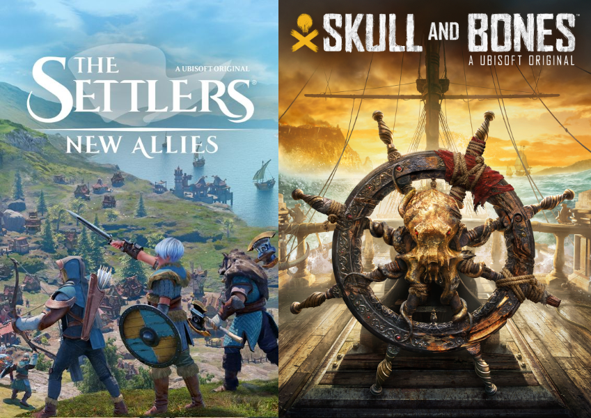
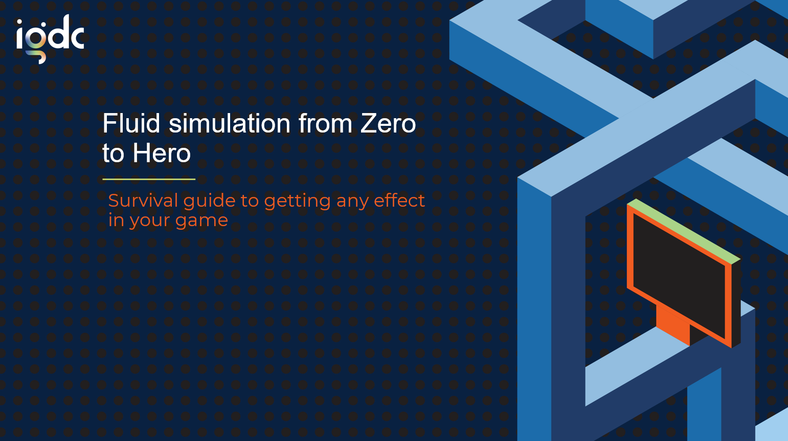
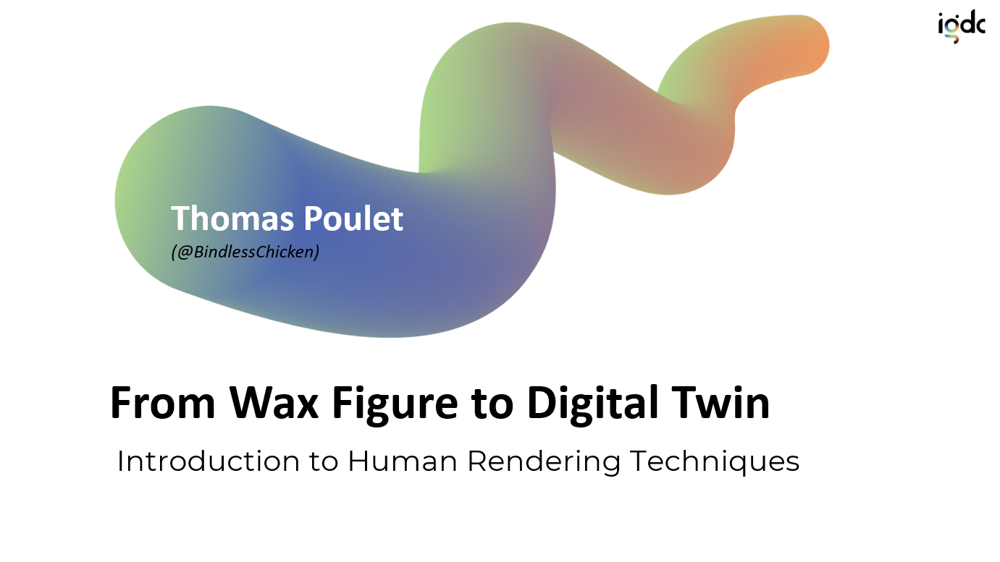
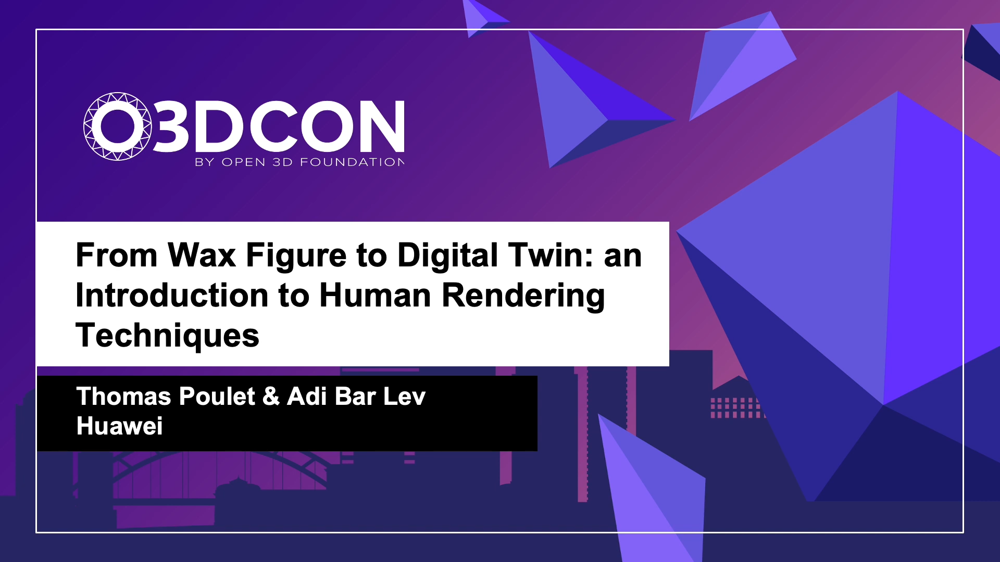
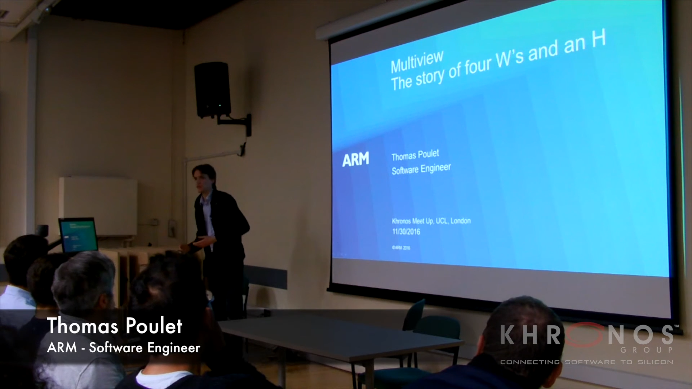

## About

Howdy.

I'm Thomas, graphics engineer by trade, but I work on pretty much everything gamedev. As long as it makes games better, and development easier, I'm in!

I'm currently working with a cool bunch of fellow AAA veteran (some of us even worked on the first AAAA, is that a valid flex?) at Something Mighty.  
We do consulting for other game studios, work on tools and technologies to facilitate our client's development experience, and if time allows we work on our own pitch.

Previously, I was working at Huawei Ireland as Principal Graphics Engineer in their Dublin Research Center. There, I was pushing the boundary of human rendering with a focus on hair rendering, developing one of the first realtime pure strand based hair rendering system.  
I was also involed in the [O3DE](https://o3de.org/) foundation.

I've also worked at [Ubisoft Berlin](https://www.ubisoft.com/en-US/studio/berlin.aspx) doing graphics and engine work on console for *The Settlers* and *Skull & Bones*.

{: .small-content}

{: .small-content}

Even before, I worked in Austria helping robots slowly take over the world, at [ARM Ltd.](https://www.arm.com/) in Cambridge, making graphical demos for [Mali GPU](http://malideveloper.arm.com/).

I'm also a public speaker having been invited to talk about tech topics in gamedev at various conferences and meetups around the world.  
Here are a couple that have been recorded.

{: .small-content}
[**Fluid simulation from Zero to Hero: Survival guide to getting any effect in your game**](https://youtu.be/bMnhI0_x6LE)

{: .small-content}
{: .small-content}
[**From Wax Figure to Digital Twin: An introduction to Human Rendering Techniques**](https://youtu.be/mrEm-jPvowU)

{: .small-content}
{: .small-content}
[**From Wax Figure to Digital Twin: An introduction to Human Rendering Techniques**](https://youtu.be/4I4bRuoK2KU)

{: .small-content}
{: .small-content}
[**Multiview: The story of four W's and an H**](https://youtu.be/GpSCyCnVJe8?t=3105)

{: .small-content}

Outisde of work, and when there is still time, I practice endurance running, music, electronics, analog photography, and watchmaking.  
Fun fact, I play Oboe, English Horn, violin (badly), and Cello. Even played six years as solist in an regional orchestra.
